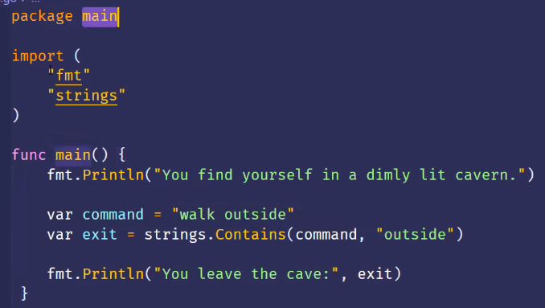
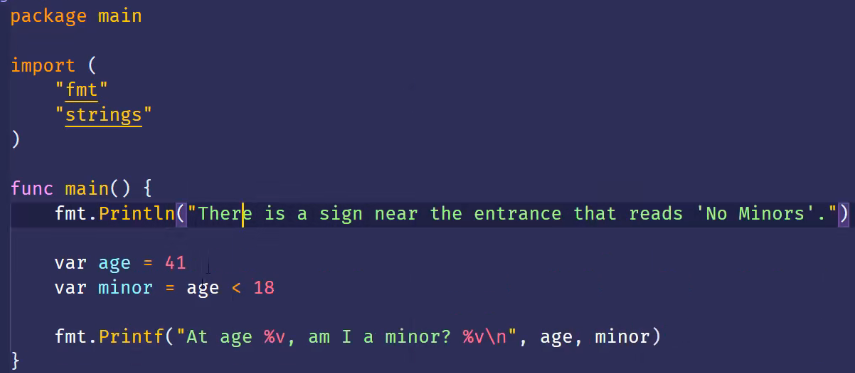
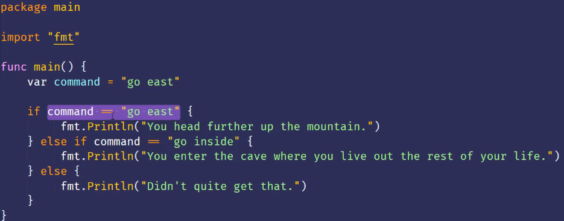
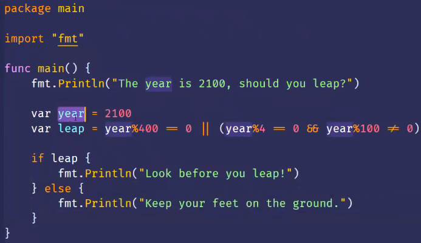
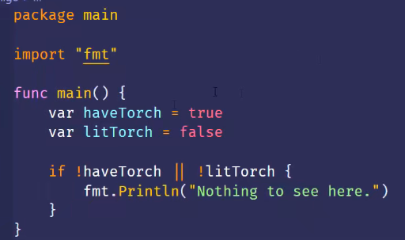
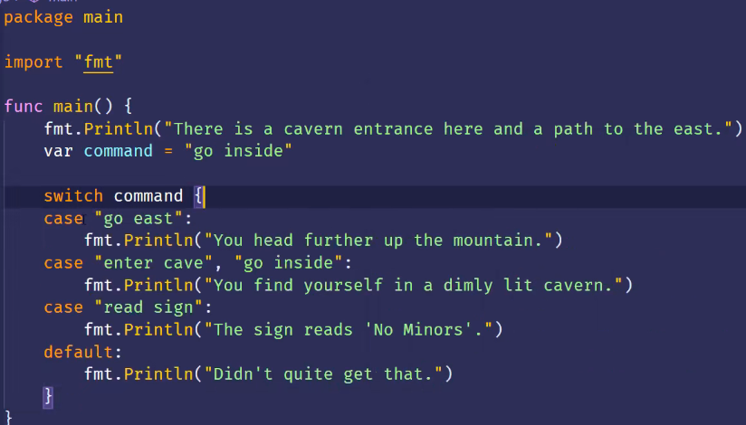
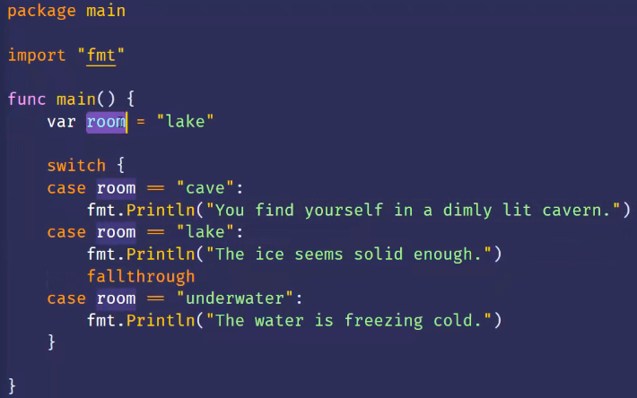
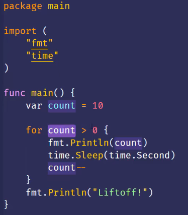

##### Boolean类型

Go只有true是真的，只有flase是假的。

##### strings.Contains

- 来自strings包的Contains函数可以判断某个字符串是否包含另外一个字符串
- 
- 比较两个值 得到的结果也是true或false

##### 比较运算符

- ==
- <=
- <
- !=
- \> =
- \>
- 

- 使用if来做分支

- else和 else if都是可选的
- 且elseif 可以重复多个

##### 逻辑运算符

- ||表示或， &&表示与。

- ||如果前面的条件为true则不执行后面的条件

##### 取反逻辑运算符

！ 可以把true变成flase， flase变成true

##### 使用switch做分支

- switch语句也可以对数字进行匹配 
- fallthrough关键字，它用来不进行条件判断就执行下一个case的body部分
  - 

##### 使用循环做重复

- for后面没跟条件，就是无线循环
  - 可以使用break跳出循环
  - 

##### 作业

实现一个猜数游戏，首先定义一个1-100的整数，然后让计算机生成一个1-100随机数，并显示计算机猜测的结果是太大还是太小，没猜对的话就继续猜，直至猜对。