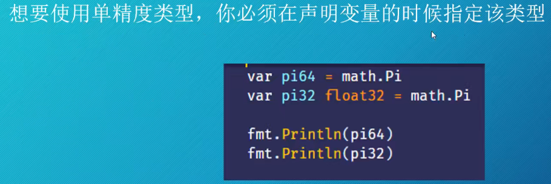
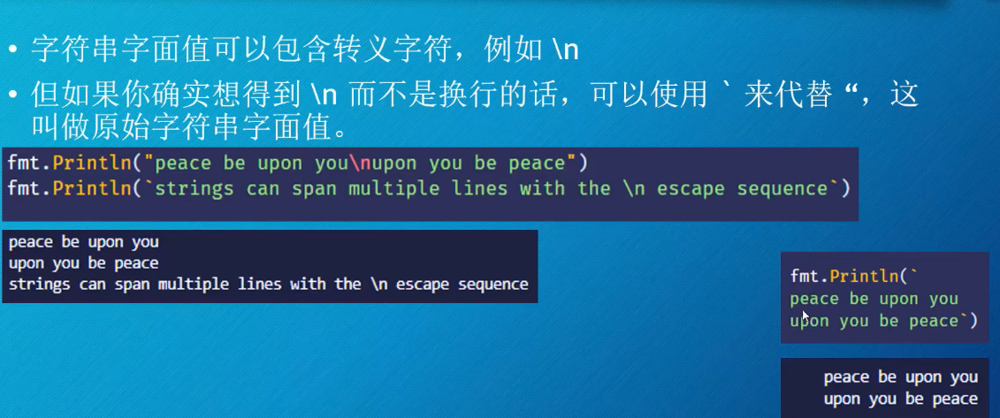
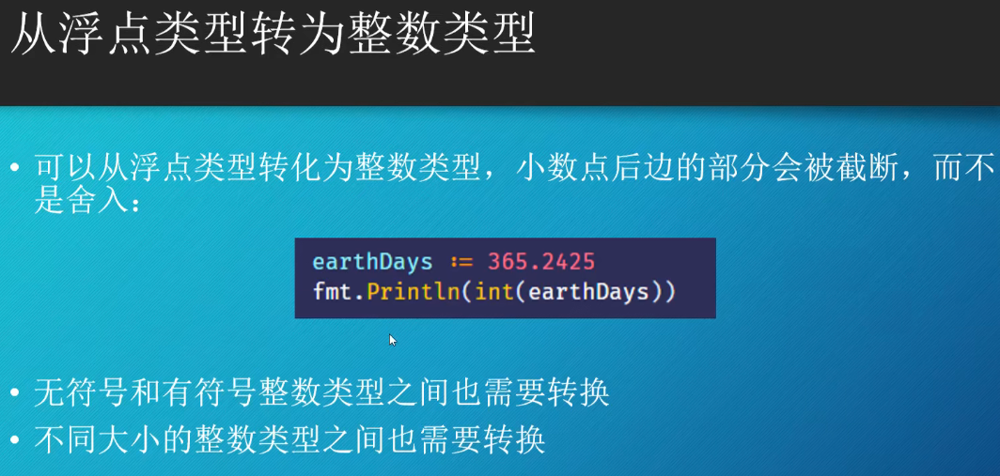
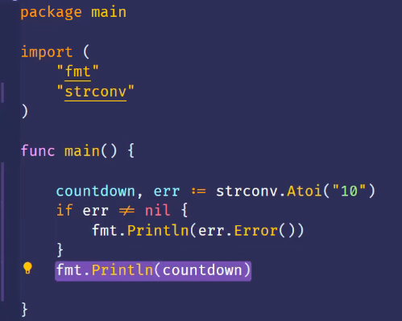
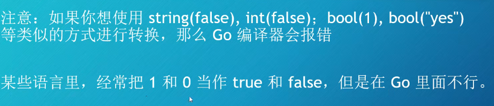

#### 实数

##### 浮点型

- 声明浮点型变量
  - 只要数字含有小数部分，那么它的类型就是float64
  - 下面这三个语句的效果都是一样的
    - 
  - 如果你使用一个整数来初始化某个变量 ，那么你必须指定它的类型为float64，否则它就是一个整数类型
  - float32单精度 float64双精度
- 单精度浮点数类型
  - 
  - 
  - 
- 零值
  - 
- 

- %f 格式化动词
  - 
  - 
- 浮点类型的精度
  - 
  - 
  - 问题 如何避免上述的舍入错误？
- 如何比较浮点类型
  - 
- 作业题
  - 编写一个程序：
    - 随机地将五分镍币（0.05美元）、一角硬币（0.10美元）和25美分硬币（0.25美元）放入一个空的储蓄罐，直到里面至少有20美元。
    - 每次存款后显示存钱罐的运行余额。
    - 并以适当的宽度和精度格式化。

##### 整数

Go语言里的整数类型

- 
- 
- 使用类型推断
  - 
- 8中整数类型
  - 整数类型，包括有符号和无符号的，实际上一共是8种类型：
    - 它们各子的取值范围不同，与架构无关
    - 
    - 在比较新的计算机上，int和uint都是64位的
  - 测试 ： 哪些整数类型能够包含-20151021

打印数据类型

- 在Prinf里使用%T就可以打印出数据的类型。
- 

十六进制表示法

- 打印十六进制
- 

整数环绕

- 

打印每个bit

- 

如何避免时间发生环绕

- 

作业题

- 

##### 很大的数

数太大了怎么办

- 
- 
- 
- 

big包

- 
- 
- big.Int 
  - 一旦使用了bit.Int ，那么等式里其他的部分也必须使用big.Int
  - NewInt()函数可以把int64转换为big.Int类型
  - 

测试题

- 用两种方式把86400转化为big.Int类型

##### 较大数值的常量

也可以不指明常量的类型

对于变量，Go会使用类型推断

针对字面值和常量的计算都是在编译阶段完成的。

Go的编译器是用Go编写的，这种无类型的数值字面值就是由big包所支持的。这使你可以操作很大的数(超过18的10^18)

只要能够容纳的下，那么常量就可以赋值给变量。

测试

- 

作业题

- 

##### 多语言文本

声明字符串

- 

字符串的零值

- var blank string  零值就是一个空字符串

字符串的字面值和原始字符串字面值

- 

小测试

- 

字符，code points， runes，bytes

- 

类型别名

- 

打印

- 
- 

字符

- 
- 测试
  - 

string

- 
- 小测试
  - 

Caesar cipher 凯撒加密法

- 对于加密信息，一种简单有效的方法就是把每个字母都移动固定长度的位置。
- 
- 小测试
  - 

ROT13

- 
- 
- 
- 

##### Go的内置函数

len 

- 
- 本例种len返回message所占的byte数。
- 内置函数不需要import

range

- 使用range关键字，可以遍历各种集合。
- 
- 

作业

- 

##### 类型转换

类型不能混用

- 
- 
- 小测试
  - Go语言里， “10”-1这个表达式会报错吗

数值类型之间的转换

- 
- 

- 
- 小测试
  - 

字符串转换

- 

- 

- 

- 

- 

- 

- 小测试

  - 说出两个函数，它们可以把整数转化为string

  **Go是静态类型语言，一旦某个变量 被声明，那么它的类型就无法再被改变了**

布尔类型的转换

- 
- 
- 测试
  - 写一个程序，把布尔类型转换为整数类型， true -》 1， false->0

作业题

- 
- 