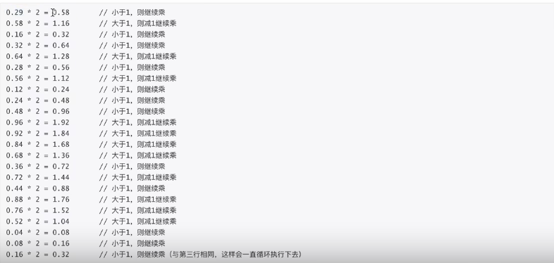
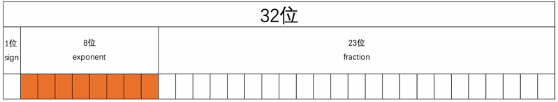
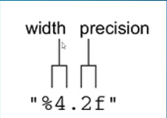
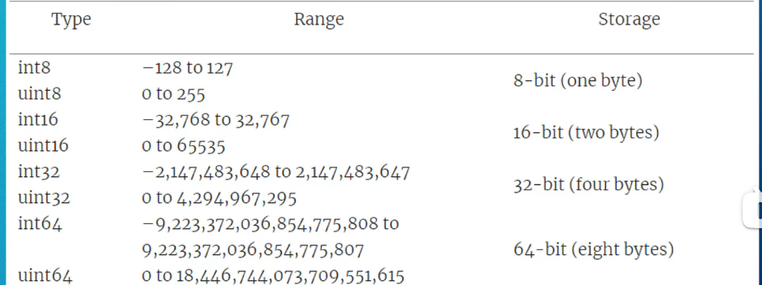
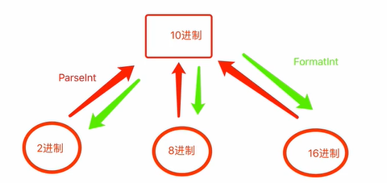
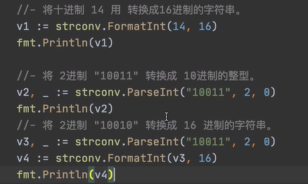
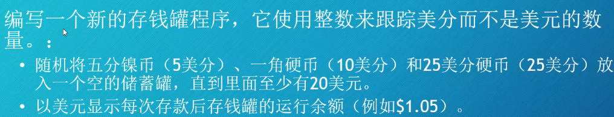

[toc]

##### 数据类型

数据类型，其实就是各种各样类型的数据。

Go语言中常见的数据类型有很多，例如：

- 整形
- 浮点型，用于表示小数。
- 布尔型，用于表示真/假
- 字符串，用于表示文本信息。
- 数组，用于表示多个数据。（数据集合）
- 指针，用于表示内存地址的类型。
- 切片，用于表示多个数据（数据集合）
- 字典，用于表示键值对集合。
- 结构体，用于自定义一些数据集合。
- 接口，用于约束和泛指数据类型。

#### 浮点型

**浮点型处理小数是非精确的**

##### 1.  float底层存储原理

```go
var price float32 = 39.29
```

1. 第一步，浮点型转换成二进制

   1. 整数部分，直接转换为二进制（10进制转换为2进制）即100111

   2. 小数部分，让小数部分乘以2，结果小于1则将结果继续乘以2，结果大于1则将结果-1继续乘以2，结果等于1则结束。

      

   3. 所以39.29的二进制表示为：100111.010010100011111010111000....

2. 第二步，科学计数法表示

   100111.010010100011111010111000...
   $$
   1.00111010010100011111010111000...*2^5
   $$

3. 第三步，存储

   以float32为例来进行存储，用32位来存储浮点型

   

   - sign，用1位来表示浮点数正负，0表示正数，1表示负数。
   - exponent，用8位来表示共256种，含正负值（-127~128）。例如：5想要存储到exponent位，需要让5 + 127 = 132 ，再将132转换为二进制，存储到exponent。（132的二进制01000010）
   - fraction，存储小数点后的所有数据。

   float64与float32类似，只是用于表示各部分的位数不同，其中sigin1位，exponent=11位，fraction=52位，意味着可表示的范围更大，精度更高。

##### 2. decimal

Go语言内部没有decimal。

第三方包，则需要在本地的Go环境中先安装再使用。第三方源码https://github.com/shopspring/decimal。

1. 安装三方包

   ```
   go get github.com/shopspring/decimal
   ```

   命令执行完成之后，在$GOPATH/src目录下就会出现github/shopspring/decimal的目录，这就是第三方模块安装的位置。

2. 使用decimal包

   ```go
   package main
   
   import (
   	"fmt"
   
   	"github.com/shopspring/decimal"
   ) 
   
   func main() {
   	price, err := decimal.NewFromString("136.02")
   	if err != nil {
   		panic(err)
   	}
   
   	quantity := decimal.NewFromInt(3)
   
   	fee, _ := decimal.NewFromString(".035")
   	taxRate, _ := decimal.NewFromString(".08875")
   
   	subtotal := price.Mul(quantity)
   
   	preTax := subtotal.Mul(fee.Add(decimal.NewFromFloat(1)))
   
   	total := preTax.Mul(taxRate.Add(decimal.NewFromFloat(1)))
   
   	fmt.Println("Subtotal:", subtotal)                      // Subtotal: 408.06
   	fmt.Println("Pre-tax:", preTax)                         // Pre-tax: 422.3421
   	fmt.Println("Taxes:", total.Sub(preTax))                // Taxes: 37.482861375
   	fmt.Println("Total:", total)                            // Total: 459.824961375
   	fmt.Println("Tax rate:", total.Sub(preTax).Div(preTax)) // Tax rate: 0.08875
   }
   ```

   ```go
   var v1 = decimal.NewFromFloat(0.0000000000000019)
   var v2 = decimal.NewFromFloat(0.29)
   
   var v3 = v1.Add(v2)
   
   var v4 = v1.Sub(v2)
   
   v5 = v1.Mul(v2)
   
   v6 = v1.Div(v2)
   var price = decimal.NewFromFloat(3.4626)
   var data1 = price.Round(1) // 保留小数点后1位（四舍五入）
   var data2 = price.Truncate(1)  //保留小数点后1位
   fmt.Println(data1, data2) // 输出： 3.5 3.5
   ```

   

##### 声明浮点型变量

只要数字含有小数部分，那么它的类型就是float64

下面这三个语句的效果都是一样的

- ```go
  package main
  
  import "fmt"
  
  func main() {
  	days := 365.2425
  	var days1 = 365.2425
  	var days2 float64 = 265.2425
  	fmt.Printf("type %T float %v \n", days, days)
  	fmt.Printf("type %T float %v \n", days1, days1)
  	fmt.Printf("type %T float %v \n", days2, days2)
  	fmt.Println(days, days1, days2)
  	month := 12
  	var month1 = 12
  	var month2 int = 12
  	var month3 float64 = 12
  	fmt.Printf("type %T int %v \n", month, month)
  	fmt.Printf("type %T int %v \n", month1, month1)
  	fmt.Printf("type %T int %v \n", month2, month2)
  	fmt.Printf("type %T float64 %v \n", month3, month3)
  	fmt.Println(month, month1, month2, month3)
  }
  
  ```

- 如果你使用一个整数来初始化某个变量 ，那么你必须指定它的类型为float64，否则它就是一个整数类型

- float32单精度 float64双精度

##### 单精度浮点数类型

- Go 语言里有两种浮点数类型：

  - 默认是float64 
    - 64位的浮点类型
    - 占用8字节内存
    - 某些编程语言把这种类型叫做double(双精度)
  - float32
    - 占用4字节内存
    - 精度比float64低
    - 有时叫单精度类型

- 想要使用单精度类型，必须在声明变量的时候指定该类型

  - ```go
    package main
    
    import (
    	"fmt"
    	"math"
    )
    
    func main() {
    
    	var pi64 = math.Pi
    	var pi32 float32 = math.Pi
    	fmt.Println(pi64, pi32)
    }
    3.141592653589793  3.1415927
    ```

- 单双精度的使用场景

  - 当处理大量数据时，例如3D游戏中的数千个顶点，使用float32牺牲精度来节省内存是很有意义的。
  - math 包里面的函数操作的都是float类型，所以应该首选使用float64，除非你有足够的理由不去使用它。

- 零值

  - Go里面的每个类型都有一个默认值，它称作零值。

  - 当声明变量却不对它进行初始化的时候，它的值就是零值。

  - ```go
    package main
    
    import (
    	"fmt"
    )
    
    func main() {
    	var price float64
    	Price := 0.0
    	fmt.Println(price, Price)
    }
    
    ```


##### 显示浮点类型

- 使用Print或Println打印浮点类型的时候，默认的行为是尽可能的多显示几位小数

- 也可以使用Printf函数，结合%f格式化动词来指定显示小数的位数

- ```go
  package main
  
  import (
  	"fmt"
  )
  
  func main() {
  	third := 1.0 / 3
  	fmt.Println(third)
  	fmt.Printf("%v\n", third)
  	fmt.Printf("f %f\n", third)
  	fmt.Printf("3f %3f\n", third)
  	fmt.Printf("4.2f %4.2f\n", third)
  	fmt.Println(third + third + third)
  }
  ```

##### %f 格式化动词

- 它由两部分组成

  - 宽度：会显示出的最少字符个数(包含小数点和小数)
    - 如果宽度大于数字的个数，那么左边会填充空格
    - 如果没指定宽度，就按实际的位数进行显示
  - 精度：小数点后边显示的位数
  - 

- 如果想使用0代替空格作为填充：

- ```go
  fmt.Printf("%05.2f\n", third)
  ```

##### 浮点类型的精度

- 浮点类型不适合用于金融类计算， 为了尽量最小化舍入错误，建议先做乘法，再做除法

  - ```go
    package main
    
    import (
    	"fmt"
    )
    
    func main() {
    	third := 1.0 / 3
    	fmt.Println(third + third + third)
    
    	piggyBank := 0.1
    	piggyBank += 0.2
    	fmt.Println(piggyBank)
    }
    1
    0.30000000000000004
    ```

  - ```go
    package main
    
    import (
    	"fmt"
    )
    
    func main() {
    	third := 1.0 / 3
    	fmt.Println(third + third + third)
    
    	piggyBank := 0.1
    	piggyBank += 0.2
    	fmt.Println(piggyBank)
    	celsius := 21.0
    	fmt.Print((celsius/5.0*9.0)+32, "℉\n")
    	fmt.Print((9.0/5.0*celsius)+32, "℉\n")
    	fahrenheit := (celsius * 9.0 / 5.0) + 32.0
    	fmt.Println(fahrenheit, "℉")
    }
    ==============================
    1
    0.30000000000000004
    69.80000000000001℉
    69.80000000000001℉
    69.8 ℉
    ```

- 问题 如何避免上述的舍入错误？先做乘法再做除法

- 如何比较浮点类型

  - ```go
    package main
    
    import (
    	"fmt"
    	"math"
    )
    
    func main() {
    	piggyBank := 0.1
    	piggyBank += 0.2
    	fmt.Println(piggyBank == 0.3)
    	fmt.Println(math.Abs(piggyBank-0.3) < 0.0001)
    }
    
    ```


##### 浮点型作业题

- 编写一个程序：

  - 随机地将五分镍币（0.05美元）、一角硬币（0.10美元）和25美分硬币（0.25美元）放入一个空的储蓄罐，直到里面至少有20美元。

  - 每次存款后显示存钱罐的运行余额。

  - 并以适当的宽度和精度格式化。

  - ```go
    package main
    
    import (
    	"fmt"
    	"math/rand"
    	"time"
    )
    func main() {
    	rand.Seed(time.Now().Unix())
    	var total_money float32 = 0.0
    	for count := 1; count > 0; count++ {
    		total_money += homework()
    		fmt.Printf("total money is %4.2f\n", total_money)
    		if total_money > 20.0 {
    			break
    		}
    		time.Sleep(time.Microsecond * 500)
    	}
    }
    
    func homework() float32 {
    	case_num := rand.Intn(4)
    	var money float32
    	switch case_num {
    	case 1:
    		money = 0.05
    	case 2:
    		money = 0.10
    	case 3:
    		money = 0.25
    	}
    	return money
    }
    =====================
    total money is 0.05     total money is 0.30     total money is 0.35     total money is 0.35     total money is 0.35     total money is 0.40       total money is 0.65     total money is 0.65     total money is 0.90     total money is 0.90     total money is 0.90     total money is 1.00       total money is 1.00     total money is 1.00     total money is 1.10
    ```

#### 整数

##### Go语言里的整数类型

- Go提供了10种整数类型：

  - 不可以存小数部分
  - 范围有限
  - 通常根据数值范围来选取整数类型

- 5种整数类型是有符号的

  - 能表示正数、0、负数

- 5种整数类型是无符号的

  - 能表示正数、0

- 最常用的整数类型是int:

- 无符号整数类型是uint:

  - ```go
    package main
    
    import "fmt"
    
    func main() {
    	var year int = 2019
    	month := 11
    	var day = 29
    	fmt.Printf("%T %v %T %v %T %v\n", year, year, month, month, day, day)
    	var ling uint = 0
    	fmt.Printf("%T %v", ling, ling)
    }
    
    ```

- 使用类型推断

  - 下面三个语句是等价的：

    - ```go
      year := 2018
      var year = 2018
      var year int = 2018
      ```

- 8中整数类型

  - 整数类型，包括有符号和无符号的，实际上一共是8种类型：
    - 它们各子的取值范围不同，与架构无关
    - 
    - 在比较新的计算机上，int和uint都是64位的
  - 测试 ： 哪些整数类型能够包含-20151021

##### 整型之间的相互转换

data := intxxx(其他整型)

```go
var v1 int8 = 10
var v2 int16 = 18
v3 := int16(v1) + v2
fmt.Println(v3, reflect.TypeOf(v3))
```

注意：

- 低位转向高位，没问题。

- 高位转向低位，可能有问题

  ```go
  var v1 int16 = 130
  v2 := int8(v1)
  fmt.Println(v2)
  // 会发生轮回
  ```

##### 整型与字符串的转换

整型转字符串

```go
v1 := 19
result := strconv.Itoa(v1) // 只能转int  不能转int8 int16 等等
fmt.Println(reslut, reflect.TypeOf(result))
```

字符串转整型

```go
v1 := "6666"
result,err := strconv.Atoi(v1) // 转换成功之后是int类型；可能存在错误
if err == nil{
	fmt.Println("转换成功", result, err)	    
}else{
    fmt.Println("转换失败")
}

```

##### 进制转换



- Go代码中:

  - 十进制，整型的方式存在。
  - 其他进制，是以字符串的形式存在。

- 整型，10进制数。

  ```go
  v1 := 5
  // 整型（十进制）转换为：二进制、八进制、十六进制
  r1 := strconv.FormatInt(int64(v1), 2)
  fmt.Println(r1, reflect.TypeOf(r1))
  ```

- 其他进制转换为十进制

  ```go
  //ParseInt data 要转换的文本
  // 2， 把文档当作二进制去转换成 十进制（整型）
  // 16， 转换的过程中对结果进行约束  可以置0 0是int范围
  
  // 结果：如果转换成功，则将err设置为nil，result则永远以int64的类型返回。
  data := "1001000100"
  result, err := strconv.ParseInt(data, 2, 16)
  fmt.Println(result, err， reflect.TypeOf(result))
  
  ```

  - 通过ParseInt将字符串转换成10进制时，本质上与Atoi是一样的。

- 练习题

- 

- ```go
  	data := "4F55"
  	result, _ := strconv.ParseInt(data, 16, 0)
  	res := strconv.FormatInt(int64(result), 2)
  	fmt.Println(res)
  ```

##### 常见数学运算

```go
    fmt.Println(math.Abs(-19))                // 绝对值
	fmt.Println(math.Floor(3.14))             // 向下取整
	fmt.Println(math.Ceil(3.14))              // 向上取整
	fmt.Println(math.Round(3.34780))          // 就近取整
	fmt.Println(math.Round(3.5478*100) / 100) // 保留小数点后两位
	fmt.Println(math.Mod(11, 3))              // 取余数 11%3
	fmt.Println(math.Pow(2, 5))               // 计算次方 2的5次方
	fmt.Println(math.Pow10(2))                //计算10次方 如2的10放
	fmt.Println(math.Max(1, 2))               // 两个值，取最大值
	fmt.Println(math.Min(1, 2))               // 两个值，取最小值
```

##### 打印数据类型 

- 在Prinf里使用%T就可以打印出数据的类型。

- ```go
  package main
  
  import "fmt"
  
  func main() {
  	var year int = 2019
  	month := 11
  	var day = 29
  	fmt.Printf("Type %T for %v, %T %v %T %v\n", year, year, month, month, day, day)
  	var ling uint = 0
  	fmt.Printf("%T %v", ling, ling)
  }
  ```

- ```go
  package main
  
  import "fmt"
  
  func main() {
  	year := 2018
  	fmt.Printf("Type %T for %v\n", year, year)
  	a := "text"
  	fmt.Printf("Tyep %T for %v\n", a, a)
  	b := 42
  	fmt.Printf("Type %T for %[1]v\n", b)
  	c := 3.14
  	fmt.Printf("Tyep %T for %[1]v\n", c)
  
  	d := true
  	fmt.Printf("Type %T for %1[v]\n", d)
  
  }
  >>>>>>>>>>>>>>>>>>>>>>>>>>>>>>>>>>
  Type int for 2018
  Tyep string for text
  Type int for 42
  Tyep float64 for 3.14
  Type bool for %!
  (BADINDEX)
  ```

##### 十六进制表示法

- Go语言里，在数前面加上0x前缀，就可以用十六进制的形式来表示数值。

  - ```go
    import "fmt"
    
    func main() {
    	// var red, green, blue uint8 = 0, 141, 213
    	// fmt.Println(red, green, blue)
    	var red, green, blue uint8 = 0x00, 0x8d, 0xd5
    	fmt.Println(red, green, blue)
    }
    ```

- 打印十六进制

  - 打印十六进制的数，使用%x格式化动词

  - ```go
    package main
    
    import "fmt"
    
    func main() {
    	// var red, green, blue uint8 = 0, 141, 213
    	// fmt.Println(red, green, blue)
    	var red, green, blue uint8 = 0x00, 0x8d, 0xd5
    	fmt.Printf("red %x green %x blue %x", red, green, blue)
    }
    ```

##### 整数环绕

- 所有整数类型都有一个取值范围，超出这个范围，就会发生“环绕”

  ```go
  package main
  import (
  	"fmt"
  )
  func main(){
      var red uint8 = 255
      red++
      fmt.Println(red)
      var number int8 = 127
      number++
      fmt.Println(number)
  }
  >>>>>>>>>>>>>>>>>>
  
  ```

##### 打印每个bit

- 使用%b格式化动词

  ```go
  package main
  import (
  	"fmt"
  )
  func main(){
  	var green uint8 = 3
      fmt.Prinft("%08b\n", green)
      green++
      fmt.Printf("%08b\n", green)
  }
  >>>>>>>>>>>>>>>>>>
  
  ```

如何避免时间发生环绕

- Unix系统里，时间是以1970年1月1日至今的秒数来表示的。但在2038年，这个数就会超过20多亿，也就是超过了int32的范围。
- 应使用:int64或uint64

##### 整数作业题

- 

  ```go
  package main
  
  import (
  	"fmt"
  	"math/rand"
  	"time"
  )
  
  func main() {
  	rand.Seed(time.Now().Unix())
  	var total_money int = 0
  	for count := 1; count > 0; count++ {
  		total_money += homework()
  		money_float := float32(total_money/10) + float32((total_money%100)/100)
  		fmt.Printf("total money is %5.2f\n", money_float)
  		if total_money > 200 {
  			break
  		}
  		time.Sleep(time.Microsecond * 500)
  	}
  }
  func homework() int {
  	case_num := rand.Intn(4)
  	var money int
  	switch case_num {
  	case 1:
  		money = 5
  	case 2:
  		money = 10
  	case 3:
  		money = 25
  	}
  	return money
  }
  ```

#### 字符串

在编写程序时，使用字符串来进行文本的处理，例如：

```go
package main

import "fmt"

func main(){
    var name string = "alex"
    fmt.Printf(name)
    
    title := "要想生活过的去"
    fmt.Printf(title)
}
```

##### 4.1 字符串的本质

计算机中所有的操作和数据最终都是二进制，即100010001111...

Go语言中的字符串是utf-8编码的序列。

```go
package main

import "fmt"

func main(){
    // unicode字符集： 文字 -》 码点（ucs4， 4个字节表示）
    // utf-8编码，对unicode字符集的码点进行编码最终得到:1000010001
    
    var name string = "何雨阳"
    // "何" 11100100 10111101 10010101
	fmt.Println(name[0], strconv.FormatInt(int64(name[0]), 2))
	fmt.Println(name[1], strconv.FormatInt(int64(name[1]), 2))
	fmt.Println(name[2], strconv.FormatInt(int64(name[2]), 2))
	fmt.Println("==============================================")
	// 雨 11101001  10011011 10101000
	fmt.Println(name[3], strconv.FormatInt(int64(name[3]), 2))
	fmt.Println(name[4], strconv.FormatInt(int64(name[4]), 2))
	fmt.Println(name[5], strconv.FormatInt(int64(name[5]), 2))
	fmt.Println("==============================================")
	// 阳 11101001 10011000 10110011
	fmt.Println(name[6], strconv.FormatInt(int64(name[6]), 2))
	fmt.Println(name[7], strconv.FormatInt(int64(name[7]), 2))
	fmt.Println(name[8], strconv.FormatInt(int64(name[8]), 2))
	fmt.Println("--------------------------------------------------")
}
```

###### 2. 获取字符串长度9 （字节长度）

```go
var name string = "何雨阳"
fmt.Println(name, len(name))
```

###### 3.字符串转换为一个“字节集合”

```go
var name string = "何雨阳"
byteSet := []byte(name)
fmt.Println(byteSet) // [228 189 149 233 155 168 233 152 179]
```

###### 4.字节集合转换为字符串

```go
	byteList := []byte{228, 189, 149, 233, 155, 168, 233, 152, 179}
	targetString := string(byteList)
	fmt.Println(targetString)
```

###### 5. rune（int32 ucs4）

将字符串转换为unicode字符集码点的集合  

```go
	// 何  -> 4F55(十六进制) 雨 -> 96e8 阳 -> 9633
	var name string = "何雨阳"
	runeSet := []rune(name) //[20309 38632 38451] (十进制)
	fmt.Println(runeSet)
	fmt.Println(runeSet[0], strconv.FormatInt(int64(runeSet[0]), 16))
	fmt.Println(runeSet[1], strconv.FormatInt(int64(runeSet[1]), 16))
	fmt.Println(runeSet[2], strconv.FormatInt(int64(runeSet[2]), 16))
```

###### 6."rune集合"转换为字符串

```go
runeString := string(runeSet)
fmt.Println(runeString)
```

###### 7.长度的处理

```go
runeLength :=utf8.RuneCountInString(name)
fmt.Println(runeLength)
```

##### 2. 字符串常见功能

###### 1.  获取长度

```go
var name string = "何雨阳"
byteLength := len(name) //获取字节长度 输出 9：
runeLength :=utf8.RuneCountInString(name) // 获取字符长度 输出：3
fmt.Println(runeLength)
```

###### 2. 是否以xx开头

```go
var name string = "何雨阳"
result := strings.HasPrefix(name, "何")
fmt.Println(result)  // 输出 ：true or false
```

###### 3. 是否以xx结尾

```go
var name string = "何雨阳"
result := strings.HasSuffix(name, "阳")
fmt.Println(result)  // 输出 ：true or false
```

###### 4.  是否包含

```go
name := "抬老子的意大利炮来"
reuslt := strings.Contain(name, "老子")
fmt.Println(result)  // 输出 ：true or false
```

###### 5. 变大写

```go
name := "heyuyang"
result := strings.ToUpper(name)
fmt.Println(result) // 输出 HEYUYANG
// 注意：result是大写，name依然是小写
```

###### 6. 变小写

```go
name := "HEYUYANg"
result := strings.ToLower(name)
fmt.Println(result) // 输出 heyuyang
```

###### 7. 去两边

```go
name := "heyuyang"
result1 := strings.TrimRight(name, "g")  //右
result2 := strings.TrimLeft(name, "h")  // 左
result3 := strings.Trim(name, "y") // 去除两边的w
fmt.Println(result1, result2, result3)
```

###### 8. 替换

```go
name := "heyuyangyuyang"
result1 := strings.Replace(name, "yu", "wu", 1) // 找到yu替换为wu，从左到右第一个替换
result2 := strings.Replace(name, "yu", "wu", 2) // 找到yu替换为wu，从左到右前两个替换
result3 := strings.Replace(name, "yu", "wu", -1) // 找到yu替换为wu, 替换所有
fmt.Println(result1, result2, result3)
```

###### 9. 分割

```go
name := "抬老子的意大利炮来"
result := strings.split(name, "的")
fmt.Println(result)
```

###### 10. 拼接 

可以使用+让两个字符串进行拼接，但这样的拼接效率非常低，不建议使用

```go
// 不建议
message := "我爱" + "天安门"
fmt.Println(message)

// 建议：效率高一些
dataList := []string{"我爱", "天安门"}
result := strings.Join(dataList, "-")

// 建议：效率更高一些(go 1.10之前)
var buffer bytes.Buffer
buffer.writeString("你想")
buffer.writeString("我干")
buffer.writeString("他")
data := buffer.String()
fmt.Println(data)

// 建议： 效率更更更高一些（go 1.10之后）
var builder strings.Builder
builder.WriteString("哈哈啊")
builder.WriteString("哈哈啊")
value := builder.String()
fmt.Print(value)
```

###### 11. string转换为int

```go
num := "666"
var data, _ = strconv.Atoi(num)
fmt.Println(data)

// 整型转字符串（strconv.ParseInt 和 strconv.FormatInt可用处理进制转换）
//十进制：整型 其他进制：字符串
var result, err = strconv.ParseInt(num, 10, 32)
fmt.Println(result, err)
```

###### 12. int转string

```go
var result =strconv.Itoa(8888)
fmt.Println(result)
```

###### 13. 字符串和 "字节集合"

```go
var name string = "何雨阳"

// 字符串转换为一个“字节集合”
byteSet := []byte(name)
fmt.Println(byteSet) // [230, 173, 160, 230, 178, 155, 233, 189, 144]

// 字节的集合转换为字符串
byteList := []byte{230, 173, 160, 230, 178, 155, 233, 189, 144}
targetString := string(byteList)
fmt.Println(targetString)

```

###### 14. 字符串和 "rune集合"

```go
var name string = "何雨阳"

// 将字符串转换为 unicode字符集码点的“集合” 
tempSet := []rune(name)
fmt.Println(tempSet)
fmt.Println(tempSet[0], strconv.FormatInt(int64(tempSet[0]),16))
fmt.Println(tempSet[1], strconv.FormatInt(int64(tempSet[0]),16))
fmt.Println(tempSet[2], strconv.FormatInt(int64(tempSet[0]),16))

// “rune集合” 转为字符串
runeList := []rune{27494, 27803, 40784}
targetName := string(runeList)
fmt.Println(targetName)
```

###### 15. string和 字符

```go
// 数字转字符串
v1 := string(65)
fmt.Println(v1) //A ASCII码

v3 := string(27494)
fmt.Println(v3) // 武
// 字符串转数字  size 最短可表示的字节
v2, size := utf8.DecodeRuneInString("A")
fmt.Println(v2, size) // 65 1
```

应用场景：生成随机数，然后调用string得到一个随机的字符

#### 很大的数

数太大了怎么办

- 浮点类型可以存储非常大的数值，但是精度不高

- 整形很精确，但取值范围有限

- 如果需要很大的数，且要求很精确

  - int64 可以容纳很大的数
  - uint64可以容纳更大的整数

- 使用big包

  ```go
  package main
  import (
  	"fmt"
  )
  func main(){
      const lightSpeed = 299792
      const secondsPerDay = 86400
      
      var distance int64 = 41.3e12
      fmt.Println("Alpha Centauri is ," distance, "km away.")
      
      days := distance / lightSpedd / secondsPerDay
      fmt.Println("That is ", days, "days of travel at light speed.")
  }
  ```

- ```go
  package main
  import (
  	"fmt"
  )
  func main(){
      var distance uint64 = 24e18
   	// var distance float64 = 24e18
      fmt.Println(distance)
  }
  ```

##### big包

**推荐：使用指针的方式，即：使用new来进行创建和初始化**

**第一步：创建超大整型的对象**

```go
// 第一步：创建一个超大整形的一个对象
var v1 big.Int  // 创建指针并初始化
var v2 big.Int  // 会重新开辟空间来存储

// 第二步：在超大整形对象中写入值
v1.SetInt64(1990)
fmt.Println(v1)

v1.SetString("90000000000", 10)
fmt.Println(v1.String())
v1.SetString("100011100000111101111", 2)  // 将二进制转换成10进制
fmt.Println(v1)

var v2 *big.Int  // 创建指针指向nil  一般用不到（直接赋值时使用）
v3 := new(big.Int)
v2 = v3  // v3赋值给v2
// v2.SetInt64(v2)  // 会报错
// fmt.Println(v2)  
```

指针

```go
v3 := new(big.Int) // 创建指针并初始化，返回一个指针
v4 := new(big.Int) // 不会重新开辟空间存储，只会开辟一块内存 内存指向的就是数据的内存地址
v3.SetInt64(1990)
fmt.Println(v3)
v3.SetString("90000000000", 10)
fmt.Println(v3.String())
v3.SetString("100011100000111101111", 2)  // 将二进制转换成10进制
fmt.Println(v3)
```

**第二步：基本的加减乘除**

```go
// n1 := new(big.Int)
// n1.SetInt64(89)
n1 := big.NewInt(89) // 等价于上面两行

n2 := new(big.Int)
n2.SetInt64(99)

result := new(big.Int)
result.add(n1, n2)
fmt.Println(result)
```

其他：

```go
v1 := big.NewInt(11)
v2 := big.NewInt(3)

result := new(big.Int)

result.sub(v1, v2)  // 减
result.Mul(v1, v2)  // 乘
result.Div(v1, v2)  // 除  只能得到商

fmt.Println(result.Int64()) // 将reuslt转换成int64
fmt.Println(result.String()) // 将result结果转换成string   一般用result.String()
// 除， 得商和余数
minder := new(big.Int)
result.DivMod(v1, v2, minder)
fmt.Println(result, minder)
```

###### 建议

- 尽量new方式去初始化并返回一个指针类的方式。

- 易错点（int和*int是两种不同的类型）

  ```go
  var n1 big.Int  // 不是指针
  v1.SetString("2400000000000000000000000000000000000000000000", 10)
  var n2 big.Int
  v2.SetString("24000000000000000000000000000000000000000000001", 10)
  
  result := new(big.Int)
  result.Add(v1, v2)  // 会报错
  result.Add(&v1, &v2)
  
  var result big.Int
  result.Add(v1,v2)
  fmt.Println(result.String())
  ```

```go
  package main
  import (
  	"fmt"
      "math/big"
  )
  func main(){
      distance := new(big.Int)
      distance.SetString("2400000000000000000000000000000000000000000000", 10)
      fmt.Println(distance)
  }
```


```go
  package main
  import (
  	"fmt"
      "math/big"
  )
  
  func main(
      lightSpedd := big.NewInt(299792)
      secondsPerDay := big.NewInt(86400)
      
      distance := new(big.Int)
      distance.SetString("2400000000000000000000000000000000", 10)
      fmt.Println("Andromeda Galaxy is ", distance, "km away.")
  	
      seconds := new(big.Int)
      senconds.Div(distance, lightspeed)
      
      days := new(big.Int)
      days.Div(seconds, secondsPerDay)
      
      fmt.Println("That is ", days, "days of travel at light speed.")
  )
```


big.Int 
- 一旦使用了bit.Int ，那么等式里其他的部分也必须使用big.Int
- NewInt()函数可以把int64转换为big.Int类型
- 如何把24×10^18转化成big.Int类型？
  - 首先new一个big.Int
  - 再通过SetString函数把数值的字符串形式，和几进制传递即可。
- 缺点：用起来繁琐，且速度慢

测试题

- 用两种方式把86400转化为big.Int类型

#### 较大数值的常量

在Go里面，可以为常量指明类型(这句话会报错):

```go
package main

import (
	"fmt"
)

func main() {
	const distance uint64 = 24000000000000000000
	fmt.Println(distance)
}
```

也可以不指明常量的类型

对于变量，Go会使用类型推断

而在Go里面，常量是可以无类型的(untyped),这句话就不会报错:

```go
const distance = 240000000000000000000000
```

```go
package main
import "fmt"

func main(){
    const distance = 24000000000000000000000000000000000
    fmt.Println(distance)
}
```

**常量使用const关键字声明，程序里的每个字面值都是常量。**

这意味着:比较大的数值可以直接使用(作为字面值)

```go
package main
import "fmt"
func main(){
    fmt.Println("Andromeda Galaxy is", 24000000000000000000000000/299792/86400, "light days away.")
}
```

针对字面值和常量的计算都是在编译阶段完成的。

Go的编译器是用Go编写的，这种无类型的数值字面值就是由big包所支持的。这使你可以操作很大的数(超过18的10^18)

只要能够容纳的下，那么常量就可以赋值给变量。


测试

- 常量和字面值的计算是在哪个阶段发生的？
- 函数可以使用无类型的常量作为函数的实际传入的参数吗？

作业题

- 大矮星是已知的距离地球最近的星系，距离我们的太阳236000000000000000公里(尽管有人质疑它是一个星系)。使用常量将此距离转换为光年。

- ```go
  package main
  
  import (
  	"fmt"
  )
  
  func main() {
  	const distance = 236000000000000000
  	fmt.Println("Andromeda Galaxy is", 236000000000000000/9460730472580800, "light days away.")
  }
  ```

#### 多语言文本

声明字符串

- ```go
  package main
  
  import (
  	"fmt"
  )
  
  func main() {
  	peace := "peace"
  	var peace1 = "peace"
  	var peace2 string = "peace"
  	fmt.Printf("type %T for %v\n", peace, peace)
  	fmt.Printf("type %T for %v\n", peace1, peace1)
  	fmt.Printf("type %T for %v\n", peace2, peace2)
  }
  >>>>>>>>>>>>>>>>>>>>>>>>>
  type string for peace
  type string for peace
  type string for peace
  ```

字符串的零值

- var blank string  零值就是一个空字符串

##### 字符串的字面值和原始字符串字面值

- 字符串字面值可以包含转义字符，例如\n

- 但如果你确实想得到\n而不是换行的话，可以使用` 来代替"，这叫做原始字符串字面值。

  ```go
   package main
  
  import (
  	"fmt"
  )
  
  func main() {
  	fmt.Println("peace be upon you \n upon you be peace")
  	fmt.Println(`strings can span multiple lines with \n escape sequence`)
  	fmt.Println(`
  	peace be upon you 
  	upon you be peace`)
  }
  ```

小测试

- 如果你想输出C:\go,那么应该使用字符串字面值还是原始字符串字面值。原始字面值

  ```go
  package main
  
  import (
  	"fmt"
  )
  
  func main() {
  	fmt.Println("C:\\go") // 转义字符串字面值
  	fmt.Println(`C:\go`) // 原始字符串字面值
  }
  ```

- 字符串字面值:string literal

- 原始字符串字面值: raw string literal

字符，code points， runes，bytes

- Unicode联盟为超过100万个字符分配了相应的数值，这个数叫作code point。
  - 例如： 65代表A，128515代表:smile:  
- 为了表示这样的unicode code point，Go语言提供了rune这个类型，它是int32的一个类型别名。
- 而byte是uint8类型的别名，目的是用于二进制数据。
  - byte倒是可以表示由ASCII定义的英语字符，它是Unicode的一个子集(共128个字符)

类型别名

- 类型别名就是同一个类型的另一个名字。

  - 所以，rune和int32可以互换使用。

- 也可以自定义类型别名，语法如下:

  ```go
  type byte = uint8
  type rune = int32
  ```

##### 打印

- 如果想打印字符而不是数值，使用%c格式化动词

- 任何整数类型都可以使用%c打印，但是rune意味着该数值表示了一个字符

  ```go
  package main
  
  import (
  	"fmt"
  )
  
  func main() {
  	a := 65
  	b := 91
  	var c rune = 67
  	fmt.Printf("%c for %v, %c for %v, %c for %v", a, a, b, b, c, c)
  }
  >>>>>>>>>>>>>>>>>>>>>>>>>
  A for 65, [ for 91, C for 67
  ```

- rune 例子

  ```go
  package main
  import (
  
  )
  func main(){
      var pi rune = 960
      var alpha rune = 940
      var omega rune = 960
      var bang byte = 33
      fmt.Printf("%v %v %v %v\n", pi, alpha, omega, bang)
      fmt.Printf("%c %c %c %c\n", pi, alpha, omega, bang)
  }
  ```

##### 字符

- 字符字面值使用''括起来。例如:'A'

- 如果没指定字符类型的话，那么Go会推断它的类型为rune

  - ```go
    package main
    
    import (
    	"fmt"
    )
    
    func main() {
    	var pi = 'A'
    	p := "A"
    	q := 'A'
    	var grade rune
    	grade = 'B'
    	var grade2 rune = 'C'
    	fmt.Printf(" pi %T for %v %c \n", pi, pi, pi) // %T 打印type %v打印字面值 %c 打印原始值
    	fmt.Printf(" p %T for %v \n", p, p)
    	fmt.Printf(" q %T for %v %c \n", q, q, q)
    	fmt.Printf("grade %T for %v %c\n", grade, grade, grade)
    	fmt.Printf("grade2 %T for %v %c\n", grade2, grade2, grade2)
    }
    >>>>>>>>>>>>>>>>>>>>>>>>>>>>>
     pi int32 for 65 A 
     p string for A
     q int32 for 65 A
    grade int32 for 66 B
    grade2 int32 for 67 C
    ```

- 这里的grade仍然包含一个数值，本例中就是65，它是A的code point

- 字符字面值也可以用byte类型：

  - ```go
    package main
    
    import (
    	"fmt"
    )
    
    func main() {
    	var star byte = '*'  // 输出*的ascii码
    	fmt.Println(star)
    }
    >>>>>>>
    42
    ```

- 测试
  
  - ASCII编码里包含多少个字符？ 128个
  - byte和rune分别是哪个类型的别名？  byte uint8  rune  int32

##### 字符串格式化

将数据格式化为特定格式的字符串，可以使用字符串格式化。

```go
func main(){
	var name, address, action string
    
    fmt.Print("请输入姓名: ")
    fmt.Scanln(&name)
    
    fmt.Print("请输入位置: ")
    fmt.Scanln(&address)
    
    fmt.Print("请输入行为")
    fmt.Scanln(&action)  // 这种输入无法获取中间有空格的输入
    reader := bufio.NewReader(os.Stdin)
    line, _, _ := reader.Readline()
    action = string(line)
    
    result := fmt.Sprintf("我叫%s 在%s正在%s", name, address, action)
    fmt.Println(result)
}
```

##### string

- 可给某个变量赋予不同的string值，但是string本身是不可以变

  ```go
  package main
  
  import (
  	"fmt"
  )
  func main(){
      // peace := "shalom"
      // peace = "salam"
      message := "shalom"
      c := mesage[5]
      fmt.Printf("%c\n", c)
      message[5] = 'd'
  }
  ```

- 小测试
  
  - 写个程序，打印出shalom的每个字符，每个字符独占一行。
  
    ```go
    package main
    import (
    	"fmt"
    )
    func main(){
        message := "shalom"
        for count := 0; count < len(message); count++ {
            fmt.Printf("%c\n", message[count])
        }
    }
    ```

##### Caesar cipher 凯撒加密法

- 对于加密信息，一种简单有效的方法就是把每个字母都移动固定长度的位置。

  ```go
  package main
  import (
  	"fmt"
  )
  func main(){
      c := 'a'
      c = c + 3
      fmt.Printf("%c", c)
      if c > 'z' {
          c = c - 26
      }
  }
  ```

- 小测试
  
  - 这个语句的作用是什么？ c = c -'a' + 'A'
    
  - 如果c是'g'，那么c最后的结果是什么？
    
    ```go
    package main
    
    import "fmt"
    
    func main() {
    	peace := "shalom"
        // len := strings.Count(peace, "") - 1
        // for count := 0; count < len+1; count++ {
    	for count := 0; count < 10; count++ {
    		c := peace[count]
    		fmt.Printf("%c\n", c)
    		if c == 'm' {
    			break
    		}
    	}
    }
    ```

##### ROT13

- ROT13（旋转13）是凯撒密码在20世纪的变体。

  - 它会把字母替换成+13后的对应的字母。

  ```go
  package main
  
  import (
  	"fmt"
  	"unicode/utf8"
  )
  
  func main() {
  	question := "¿Cómo está?"
  
  	fmt.Println(len(question), "bytes")                    // 返回字符串字节数
  	fmt.Println(utf8.RuneCountInString(question), "runes") // 按rune计算字符串长度
  
  	c, size := utf8.DecodeRuneInString(question) // 返回第一个字符，以及字符所占的字节数
  	fmt.Printf("First rune: %c %v bytes", c, size)
  }
  >>>>>>>>>>>>>>>>>>>>>>>>>>>>>>>>>>>>>>>>>
  14 bytes
  11 runes
  First rune: ¿ 2 bytes
  ```

- 本例中，程序访问的是message这个字符串的每个字节(8位)，没有考虑多字节的情况（16位、32位）。

- 如何支持西班牙语、俄语、汉语等？

  - 把字符解码成rune类型，然后再进行操作。

- 使用utf-8包，它提供可以按rune计算字符串长度的方法。

- DecodeRuneInString函数会返回第一个字符，以及字符所占的字节数。

  ```go
  package main
  import "fmt"
  
  func main(){
      message := "uv vagreangvbany fcnpr fgngvba"
      
      for i := 0; i < len(message); i++{
          c := message[i]
          if c >= 'a' && c <= 'z' {
              c = c + 13
              if c > 'z' {
                  c = c -26
              }
          }
          fmt.Printf("%c ", c)
      }
  }
  ```

#### Go的内置函数

##### len 

- ```go
  package main
  import (
  	"fmt"
  )
  func main(){
      message := "uv vagreangvbany fcnpr fgngvba"
      fmt.Println(len(message))
  }
  ```

- 本例中len返回message所占的byte数。

- 内置函数不需要import

##### range

- 使用range关键字，可以遍历各种集合。

- ```go
  package main
  import (
  	"fmt"
  )
  func main(){
      question := "¿Cómo está?"
      for i,c := range question {
          fmt.Printf("%v %c \n", i, c)
      }
  }
  ```

- ```go
  package main
  import (
  	"fmt"
  )
  func main(){
      question := "¿Cómo está?"
      for _,c := range question {
          fmt.Printf("%c\n", c)
      }
  }
  ```

作业

- 1. Lfdph, Lvdz, L frqtxhuhg, 每个字母向前移动3个位置，能得到什么字符串？

     ```go
     package main
     
     import "fmt"
     
     func main() {
     	message := "Lfdph, Lvdz, Lfrqtxhuhg"
     
     	for i := 0; i < len(message); i++ {
     		c := message[i]
     		if c > 'A' && c < 'z' {
     			c = c - 3
     			if c > 'z' {
     				c = c - 26
     			}
     		}
     		fmt.Printf("%c ", c)
     	}
     }
     ```

  2. 把西班牙语"Hola Estación Espacial Internacional" 用 ROT13进行加密

     1. 使用range关键字
     2. 带重音符号的字母要保留

     ```go
     package main
     
     import "fmt"
     
     func main() {
     	message := "Hola Estación Espacial Internacional"
     	s := 'ó'
     	fmt.Printf("%c %v\n", s, s)
     	for i := 0; i < len(message); i++ {
     		c := message[i]
     		if c == 243 {
     			continue
     		} else if c > 'A' && c < 'z' {
     			c = c + 13
     			if c > 'z' {
     				c = c - 26
     			}
     		}
     		fmt.Printf("%c ", c)
     	}
     }
     ```

#### 类型转换

类型不能混用

- 连接两个字符串，使用+运算符：

  - ```go
    countdown := "Launch in T minus " + "10 seconds."
    ```

- 如果想连接字符串和数值，是会被报错的

  - ```go
    countdown  "Launch in T minus " + 10 + " seconds."
    ```

- 整型和浮点类型不能混用

  - ```go
    age := 41
    marDays :=687
    earthDays := 365.2425
    fmt.Println("I am", age* earthDays/marsDay, "years old on Mars.")
    ```

- 小测试
  
  - Go语言里， “10”-1这个表达式会报错吗 会 illegal  rune literal syntax

##### 数值类型之间的转换

- 下例中，如果想把age转化成浮点类型，需要使用目标类型将其“包裹起来”;

  - ```go
    age := 41
    marsage := float64(age)
    ```

- 从浮点类型转化为整数类型，小数点后便的部分会被截断，而不是舍入：

  - ```go
    earthDays := 365.2425
    fmt.Println(int(earthDays))
    ```

- 无符号和有符号整数类型之间也需要转换

- 不同大小的整数类型之间也需要转换

- 类型转换时需谨慎

  - “环绕行为”：

    ```go
    var bh float64 = 32768
    var h = int16(bh)
    fmt.Println(h)
    ```

  - 可以通过math包提供的max、min常量，来判断是否超过最大最小值

    ```go
    var bh float64 = 32768
    if bh < math.MinInt16 || bh > math.MaxInt16{
        // handle out of range value
    }
    ```

小测试

```go
package main
import (
	"fmt"
)
func main(){
    v :=42
    if v >= 0 && v <= math.MaxUint8{
        v8 := uint8(v)
        fmt.Println("Converted:", v8)
    }
}
```

##### 字符串转换

- 把 rune、byte转换成string，语法一样:

  - ```go
    var pi rune = 960
    var alpha rune = 940
    var omega rune = 969
    var bang byte = 33
    fmt.Print(string(pi), string(alpha), string(omega), string(bang))
    ```

    ```go
    package main
    import (
    	"fmt"
        "strconv"
    )
    func main(){
        countdown := 10 // strconv.Itoa() 数字转字符串
        str := "Launch in T minus " + strconv.Itoa(coutndown) + " seconds."
        // str := "Launch in T minus " + strconv.FormatInt(int64(countdown), 10) + " seconds."
        fmt.Println(str)
    }
    ```

- 想把 数值转化成string，它的值必须能转化为code point。

- strconv包的Itoa函数就可以做这件事：

  ```go
  str := "Launch in T minus " + strconv.Itoa(coutndown) + " seconds."
      fmt.Println(str)
  ```

- Itoa 是Integer to ASCII的意思。
- Unicode是ASCII的超集，它们前128个code points 是一样的(数字、英文字母、常用标点)

- 另外一种把数值转化为string的方式是使用Sprintf函数，和Printf类似，但会返回一个string

  ```go
  couundown := 9
  str := fmt.Sprintf("Launch in T minus %v seconds.", countdown)
  fmt.Println(str)
  ```

- strconv包里面还有个Atoi(ASCII to Integer) 函数。

- 由于字符串里面可能包含任意字符，或者要转换的数字字符串太大，Atoi函数可能会发生错误:

  ```go
  countdown, err := strconv.Atoi("10")
  if err != nil {
      // oh no, something went wrong
  }
  fmt.Println(countdown)
  ```

  - 如果err的值为nil，那么就代表没发生错误。

- ```go
  package main
  import (
  	"fmt"
      "strconv"
  )
  func main(){
      countdown, err := strconv.Atoi("10")
      if err != nil {
          fmt.Println(err.Error())
      }
      fmt.Println(countdown)
  }
  ```

- 小测试

  - 说出两个函数，它们可以把整数转化为string  

  **Go是静态类型语言，一旦某个变量 被声明，那么它的类型就无法再被改变了**

##### 布尔类型的转换

- Print家族的函数，会把bool类型的值打印成true/false的文本

- ```go
  launch := false
  launchText := fmt.Sprintf("%v", launch)
  fmt.Println("Ready for launch: ", launchText)
  
  var yesNo string
  if launch{
      yesNo = "yes"
  } else {
      yesNo = "no"
  }
  fmt.Println("Ready for launch: ", yesNo)
  ```

- 如果使用string(flase), int(flase), bool(1), bool("yes")等类似的方式进行转换，Go编译器会报错

测试

- 写一个程序，把布尔类型转换为整数类型， true -》 1， false->0

  ```go
  package main
  import (
  	"fmt"
  )
  func main(){
      BoolText := true
      var number int
      if BollText {
          number = 1
      } else {
          number = 0
      }
      fmt.Println(BoolText, number)
  }
  ```

作业题

- 写一个程序，把字符串转换成布尔类型:

  ```go
  package main
  
  import (
  	"fmt"
  )
  
  func main() {
  	text := "a"
  	var boolText bool
  	if text == "true" || text == "yes" || text == "1" {
  		boolText = true
  		fmt.Println(boolText)
  	} else if text == "false" || text == "no" || text == "0" {
  		boolText = false
  		fmt.Println(boolText)
  	} else {
  		fmt.Println("error!")
  	}
  }
  ```

