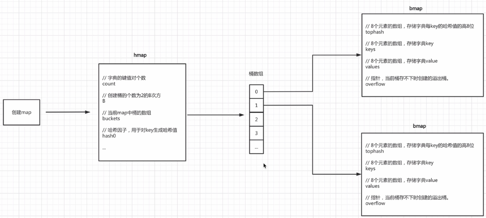
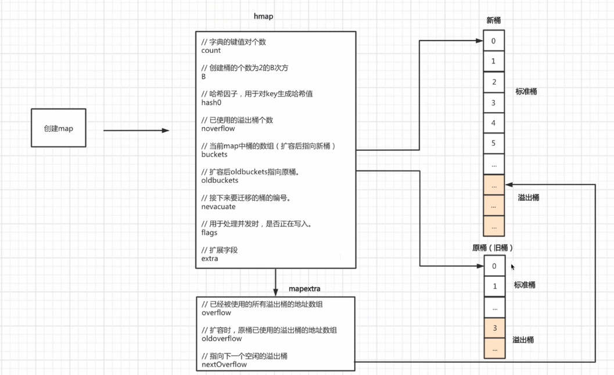
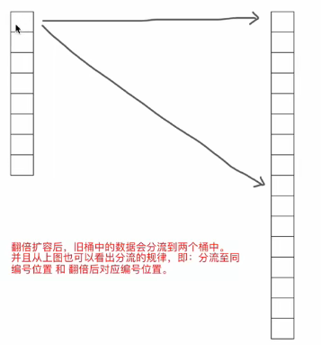
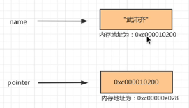
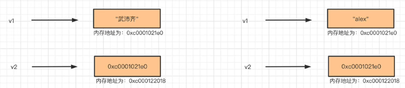
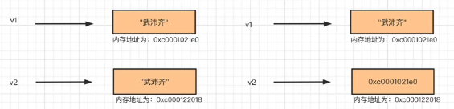
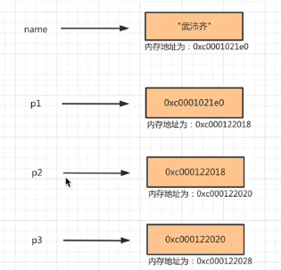
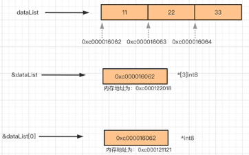

#### 1. 字典类型（Map）

字典（dict）或映射（map） 以键值对为元素的数据集合

```go
{
    "age": "18",
    "name": "何雨阳",
    "email": "hahahha@163.com"
}
```

这种数据类型的特点就是**查找速度非常快**，因为它的底层存储是**基于哈希表存储**的。

以`取模+拉链法`快速了解哈希表存储原理 


这种结构之所以快，是因为根据key可以直接找到数据存放的位置，而其他的数据类型是需要从前到后去注意对比，相对来说比较耗时。

以上只是基本的存储模型，各个编程语言中的字典都会在此基础上进行相应的修改和优化。

Map的特点：  

- 键不能重复
- 键必须可哈希（int/bool/float/string/array）
- 无序

##### 1.1 声明&初始化

```go
userInfo := map[string]string{}


userInfo := map[string]string{"name":"heyuyang", "age":"21"}

fmt.Println(userInfo["age"])

userInfo["name"] = "hewuxin"

userInfo["email"] = "hahaha@163.com"
```

```go
data := make(map[int]int, 10)

data := make(map[int]int)

data[11] = 111
data[22] = 222
data[333] = 33
```

```go
data := make(map[int]int)

data[11] = 111
data[22] = 222
data[333] = 33

// 声明 nil
var row map[int]int
// row[1] = 111  报错
row = data
```

```go
// 声明 nil
value := new(map[string]int)
// value["k1"] = 123 报错

data := make(map[string]int)
data["111"] = 111

value = &data  // 将data 的地址赋给value
```

注意：键不重复&键可哈希（int/float/string/array/bool)

```go
v1 := make(map[[2]int]float32)

v1[[2]int{1, 1}] = 1.6
v1[[2]int{1,2}] = 3.1

v2 := make(map[[2]int][3]int)
data = [2]int{1,1}
data1 = [3]int{1,2,3}
v2[data] = data1
```

##### 1. 2 常用操作

###### 1.2.1 长度

```go
data := map[string]string{"n1": "heyuyang", "n2": "hewuxin"}
value := len(data) // 2 计算map中键值对的个数
```

```go
// 根据参数值（10）， 计算出合适的容量
// 一个map中会包含很多桶， 每个桶中至少可以存储8个键值对。
info := make(map[string]string, 10)

info["n1"] = "heyuyang"
info["n2"] = "hewuxin"
v1 := len(info) // 2
// v2 := cap(info) // 报错
```

###### 1.2.2 添加

```go
data := map[string]string{"age": "18", "name": "heyuyang"}
data["email"] = "hahaha@163.com"
```

###### 1.2.3 修改

```go
data := map[string]string{"age": "18", "name": "heyuyang"}
data["age"] = "19"
```

###### 1.2.4 删除

```go
data := map[string]string{"age": "18", "name": "heyuyang"}
delete(data, "age")
```

###### 1.2.5  查看

```go
data := map[string]string{"age": "18", "name": "heyuyang"}

data["age"]


for key, value := range data{
    fmt.Println(key, value)
}

for key := range data{
    fmt.Println(key)
}

for _, value := range data{
    fmt.Println(value)
}
```

###### 1.2.6 嵌套

```go
v1 := make(map[string]int)
v2 := make(map[string]string)
v3 := make(map[string]...)
v4 := make(map[string][2]int)
v5 := make(map[string][]int)
v6 := make(map[string]map[string]string)
```

```go
v7 := make(map[string][2]map[string]string)
v7["n1"] = [2]map[string]string{{"name": "hewuxin", "age": "18"}, {"name": "hewuxin", "age": "20"}}
v7["n2"] = [2]map[string]string{{"name": "Hewuxin", "age": "8"}, {"name": "Hewuxin", "age": "201"}}

// 伪代码
v7 = {
    n1 : [
       {"name": "hewuxin", "age": "18"},
        {"name": "hewuxin", "age": "20"}
    ],
    n2 : [
        {"name": "Hewuxin", "age": "8"},
        {"name": "Hewuxin", "age": "8"}
    ]
}
```

前提：键不重复&键必须可哈希

```go
v8 := make(map[int]int)
v9 := make(map[string]int)
v10 := make(map[float32]int)
v11 := make(map[bool]int)
v12 := make(map[[2]int]int)
v13 := make(map[[]int]int) // 错误， []int 切片不可哈希
v14 := make(map[map[int]int]int) // 错误, 不可哈希
v15 := make(map[[2][]int]int) // 报错 
v16 := make(map[[2]map[string]string]int) // 报错
```

###### 1.2.7 变量赋值

```go
v1 := map[string]string{"n1": "heyuyang", "n2": "hewuxin"}
v2 := v1

v1["n1"] = "何雨阳"
fmt.Println(v1) // {"n1": "何雨阳", "n2": "hewuxin"}
fmt.Println(v2) // {"n1": "何雨阳", "n2": "hewuxin"}
```

注：无论是否存在扩容都指向同一个地址。

##### 1.3 Map底层原理剖析



Golang中的Map有自己的一套实现原理，其核心是由`hmap`和`bmap`两个结构体实现。

###### 1.3.1 初始化

```go
//初始化一个可容纳10个元素的map
info := make(map[string]string, 10)
```

- 第一步：创建一个hmap结构体对象。

- 第二步：生成一个哈希因子hash0 并赋值到hmap对象中（用于后续为key创建哈希值）。

- 第三步：根据hint=10，并根据算法规则来创建B，当前B应该为1。

- 第四步：根据B去创建桶（bmap对象）并存放在buckets数组中，当前bmap的数量应为2。

  - 当B<4时，根据B创建桶的个数的规则为：
    $$
    2^B(标准桶)
    $$

  - 当B>=4时，根据B创建桶的个数的规则为：
    $$
    2^B+2^{B-4}
    $$

  注意：每个bmap中可以存储8个键值对，当不够存储时需要使用溢出桶，并将当前bmap中的overflow字段指向溢出桶的位置。

###### 1.3.2  写入数据

```go
info["name"] = "何雨阳"
```

在map中写入数据时，内部的执行流程为：

- 第一步：结合哈希因子和键name生成哈希值`01111111111100011010101`

- 第二部：获取哈希值的`后B位`，并根据后B位的值来决定将此键值对存放到哪个桶中（bmap）。

  ```  
  将哈希值和桶掩码(B个为1的二进制)进行&运算，最终得到哈希值的后B位的值，假设当B为1时，其结果为0：
  哈希值：01111111111100011010100
  桶掩码：00000000000000000000001
  结果： 00000000000000000000000 = 0
  找桶的原则实际上是根据后B位的位运算计算出索引位置，然后再去buckets数组中根据索引找到目标桶（bmap）
  ```

- 第三步： 在上一步确定桶之后，接下来就是在桶中写入数据

  ```
  获取哈希值的tophash(即哈希值的高8位)，将tophash、key、value分别写入桶中的三个数组中。
  如果桶已满，则通过overflow找到溢出桶，并在溢出桶中继续写入。
  
  注意：以后在桶中查找时，会基于tophash来找（tophash相同再去比较key）。
  ```

- 第四步： hmap中的个数count++（map中的元素个数+1）

###### 1.3.3 读取数据

```go
value := info["name"]
```

在map中读取数据时，内部的执行流程为：

- 第一步：结合哈希因子和键`name`生成哈希值。

- 第二步： 获取哈希值的`后B位`，并根据后B位的值来决定此键值对存放在哪个桶中(bmap)。

- 第三步：确定桶之后，再根据key的哈希值计算出`tophash（高8位）`，根据tophash和key去桶中查找数据。

  ```
  如果当前桶没有找到，就根据overflow再去溢出桶中找，均未找到则表示key不存在。
  ```

###### 1.3.4 扩容

在向map中添加数据时，当达到某个条件，则会引发map扩容。

扩容条件：

- map中数据总个数/桶个数 >6.5, 引发翻倍扩容。
- 使用了太多的溢出桶时（溢出桶使用太多会导致map处理速度降低）。
  - B <= 15,已使用的溢出桶个数$ >= 2^B $,引发等量扩容。
  - B > 15, 已使用的溢出桶个数$ >= 2^{15} $时，引发等量扩容。



###### 1.3.5 迁移

扩容之后，必然要伴随着数据的迁移，即：将旧桶中的数据要迁移到新桶中。

**翻倍扩容**

如果是翻倍扩容，那么迁移规则就是将旧桶中的数据分流至新的两个桶中（比例不定），并且桶编号的位置位：桶编号位置和翻倍后的对应编号位置。



如何实现这种迁移？

- 首先，要知道如果翻倍扩容(数据总个数/桶个数 > 6,5),则新桶个数是旧桶的2倍，即：map中B的值+1(因为同的个数等于 $ 2^B $, 而翻倍之后新桶的个数就是$ 2^B *2 $, 也就是$ 2^B+1 $, 所以`新桶的B的值=原桶B + 1`)。

- 迁移时会遍历某个旧桶中所有的key(包括溢出桶)，并根据key重新生成哈希值，根据哈希值的`低8位`来决定将此键值对分流到哪个新桶中。

  

扩容后，B的值在原来的基础上已加1，也就意味着通过多1位来计算此键值对要分流到新桶位置，如上图：

- 当新增的位(红色)的值为0，则数据会迁移到与旧桶编号一致的位置。
- 当新增的位(红色)的值为1，则数据会迁移到翻倍后对应编号位置。

例如：

```
旧桶个数为32个，翻倍后新桶的个数为64。
在重新计算旧桶中的所有key哈希值时，红色位只能是0或1，所以桶中的所有数据的后B位只能是以下两种情况：
  - 000111[7], 意味着要迁移到与旧桶编号一致的位置。
  - 100111[39], 意味着会迁移到翻倍后对应编号位置。
注意： 同一个桶中key的哈希值的低B位一定是相同的，不然不会放在同一个桶中，所以同一个桶中黄色标记的位都是相同的。
```

**等量扩容**

如果是等量扩容（溢出桶太多引发的扩容），那么数据迁移机制就会比较简单，就是将旧桶（含溢出桶）中的值迁移到新桶中。

这种扩容和迁移的意义在于：当溢出桶比较多而每个桶的数据又不多时，可以通过等量扩容和迁移让数据更紧凑，从而减少溢出桶。

#### 2. 指针

指针是一种数据类型，用于表示数据的内存地址。

```go
// 声明一个 字符串类型 的变量(默认初始化值为空字符串)
var v1 string

// 声明一个 字符串的指针类型 的变量(默认初始化值为nil)
var v2 *string
```

```go
// 声明一个 字符串类型的变量， 值为 何雨阳
var name string = "何雨阳"

// 声明一个 字符串的指针类型的变量 值为name对应的内存地址
var pointer *string = &name

var age int = 18

var x1 *int = &age
```



##### 2.1 指针存在的意义

相当于创建了一个地址的`引用`，以后根据这个引用获取它里面的值。



```go
v1 := "何雨阳"
v2 := &v1
fmt.Println(v1, v2, *v2) // 何雨阳 0xc0001021e0 何雨阳

v1 = "hewuxin"
fmt.Println(v1, v2, *v2) // hewuxin 0xc0001021e0 hewuxin
```

##### 3.2 指针的应用场景

场景1：

```go
v1 := "heyuyang"
v2 := v1
v1 = "hewuxin"
fmt.Println(v1, v2) // hewuxin  heyuyang
```

```go
v1 := "heyuyang"
v2 := &v1
v1 = "hewuxin"
fmt.Println(v1, *v2) // hewuxin hewuxin
```



场景2：

```go
package main
import "fmt"

func changeData(data string){
    data := "哈哈哈"
}

func main(){
    name := "何雨阳"
    // 本质上会将name的值拷贝一份，并赋值给data
    changeData(name)
    fmt.Println(name) // 何雨阳
}
```

```go
package main
import "fmt"

func changeData(ptr *string){
    *ptr := "哈哈哈"
}

func main(){
    name := "何雨阳"
    changeData(&name)  // 这里传入的是name的地址传给ptr
    fmt.Println(name) // 哈哈
}
```

场景3：

```go
package main
import "fmt"

func main(){
    var username string
    fmt.Println("请输入用户名: ")
    fmt.Scanf("%s", &username)
    
    // 提示用户输入，当用户输入之后，将输入的值赋给内存地址对应的区域中。
    if username == "何雨阳"{
        fmt.Println("login successful!")
    }else{
        fmt.Println("login failure.")
    }
}
```

##### 3.3 指针的指针

```go
name := "何雨阳"

// 声明一个指针类型变量p1，内部存储name的内存地址
var p1 *string = &name

// 声明一个指针的指针类型变量p2，内部存储指针p1的内存地址
var p2 **string = &p1

// 声明一个指针的指针的指针类型变量p3，内部存储指针p2的内存地址
var p3 ***string = &p2
	fmt.Println(name, &name)
	fmt.Println(p1, &p1)
	fmt.Println(p2, &p2)
	fmt.Println(p3, &p3)
```



因为有指针的指针的存在，所以在使用指针进行重置时，也需要将相应的*号设置好，例如:

```go
package main

import "fmt"

func main(){
    name := "何雨阳"
    fmt.Println(name, &name)
	
    // 声明一个指针的指针类型变量p1，内部存储name的内存地址    
    var p1 *string = &name 
    fmt.Println("This is p1")
	fmt.Println(*p1, p1, &p1)
    *p1 = "张三"
    fmt.Println(*p1, p1, &p1)

    // 声明一个指针的指针类型变量p2，内部存储指针p1的内存地址
    var p2 **string = &p1
    fmt.Println("This is p2")
	fmt.Println(**p2, *p2, p2, &p2)
    **p2 = "啦啦"
    fmt.Println(**p2, *p2, p2, &p2)
    
    var p3 ***string = &p3
    fmt.Println("This is p3")
	fmt.Println(***p3, **p3, *p3, p3, &p3)
    ***p3 = "wodiu"  // 将name的内存中的值由 啦啦 改为wodiu
    fmt.Println(***p3, **p3, *p3, p3, &p3)
    
}
```

##### 3.4 指针高级小操作

- 数组的地址 == 数组的第一个元素的地址。

  

  ```go
  dataList := [3]int8{11, 22, 33}
  
  fmt.Printf("数组的地址为 %p; 数组的第一个元素的地址为 %p\n",&dataList, &dataList[0])
  // dataList 和&dataList[0] 的内存中存储的数据虽然相同，但他们是两个不同类型的指针。
  // &dataList *[3]int8
  // &dataList[0] *int8 
  ```

- 指针的计算

  ```go
  package main
  
  import (
   "fmt"
   "unsafe"
  )
  
  func main(){
      dataList := [3]int8{11, 22, 33}
      
      // 1.获取数组第一个元素的地址(指针)
      var firstDataPtr *int8 = &dataList[0]
      
      // 2. 转换成Pointer类型
      ptr := unsafe.Pointer(firstDataPtr)
      
      // 3. 转换成uintptr类型，然后进行内存地址的计算(即：地址加1个字符，意味着取第2个索引位置的值)
      targetAddress := uintptr(ptr) + 1
      // 4. 根据新地址，重新转成Pointer类型
      newPtr := unsafe.Pointer(targetAddress)
      
      // 5.Pointer对象转换成int8类型
      value := (*int8)(newPtr)
  
  	// 6.根据指针获取值
      fmt.Println("最终结果为：", *value)
  }
  ```

  


