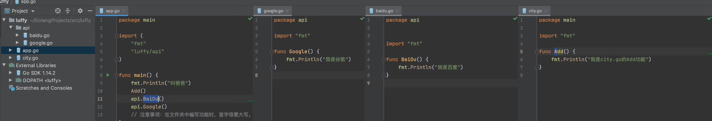

- [GO简介](#go简介)
    - [GO语言是一门编译语言](#go语言是一门编译语言)
    - [Go Playground  在线编辑器 需要翻墙](#go-playground--在线编辑器-需要翻墙)
    - [安装GO和开发工具](#安装go和开发工具)
    - [包和函数  package&function](#包和函数--packagefunction)
    - [问题](#问题)
    - [第一个Go程序](#第一个go程序)
    - [运行项目](#运行项目)
    - [包管理](#包管理)
### GO简介

##### GO语言是一门编译语言

> 在运行代码之前，GO首先使用编译器把代码转换成机器能够读懂的0和1。把所有的代码编译成一个可执行文件，在编译的过程中，Go编译器能够捕获一些错误。
>
> Python、Ruby等很多语言都是使用解释器，随着程序的运行，一个语句一个语句的进行编译，但这也意味着bug可能就潜伏在你还没测试过的代码路径上。

##### Go Playground  在线编辑器 需要翻墙

##### 安装GO和开发工具

- GO安装包

  - 环境变量 

    ```
    GOROOT,GO编译器安装目录
    GOPATH 用于存放项目代码，编译后的可执行文件，
    GOBIN 编译后的可执行文件存放的目录。
    ```

    

- Visual Studio Code
  - 先安装go的扩展包
  - ctrl + shift + p 输入 go:install/update tools
  - GO代理 cmd 输入
  
    - 如果要持久改变 需要添加到系统环境变量
    - go env -w GO111MODULE=on 
    -  go env -w GOPROXY=https://goproxy.cn,direct
  

##### 包和函数  package&function

- 包 package 声明代码所属的包  每个包只做一类工作
- func 声明函数
- 运行go语言程序时会从package main中main函数开始执行

##### 问题

- Go编译器有哪些优点？

- Go的程序从哪里开始运行？

- fmt这个package提供了哪些功能？

- 左{放在哪不会引起语法错误

- 编写程序 第一行输出 hello,world 第二行输出Hello

  ```go
  package main
  import ("fmt")
  func main() {
  	fmt.Println("This is practice_01!")
  	fmt.Printf("This is %v", "Printf") // Print默认不换行
  	fmt.Println("Hello world")
  	fmt.Printf("This is %v * %v = %v", 1, 3, 1*3)
  }
  ```

##### 第一个Go程序

1. go mod init

   使用go moduel模式新建项目时，需要通过go mod init 项目名 命令对项目进行初始化，该命令会在项目根目录下生成go.mod文件

```
go mod init hello
```

2. 编写代码 

   接下来在该目录中创建一个hello.go文件

```go
package main
import (
	"fmt"
)
func main(){
	fmt.Println("hello world")
}
```

3. 编译

   go build 命令表示将源代码编译成可执行文件

   在hello目录下执行

   ```
   go build
   go build -o xxx.exe	
   ```

4. 执行

   直接执行exe文件 或者 go run hello.go

ctrl + J 打开终端

##### 运行项目

- go run  运行项目代码，内部会先编译并将编译后的文件放在系统的临时目录，然后再自动执行。
- go build 运行项目代码，手动编译并生成一个可执行文件，再自动执行。
- go install 生成发可执行文件+包文件，并且将编译后的文件放到bin/pkg目录。go install + 项目名

##### 包管理

关于包管理的总结： 知道项目中文件和文件、文件和文件夹之间的关系

- 一个文件夹可以称为一个包。
- 在文件夹(包)中可以创建多个文件。
- 在同一个包下的每个文件中必须指定包名称 且必须相同。

重点：关于包的分类

-  main包， 必须写一个main函数，此函数就是项目的入口（main主函数）。编译生成的是一个可执行文件。
- 非main包 。用来将代码分类，分别放在不同的包和文件中。
- 