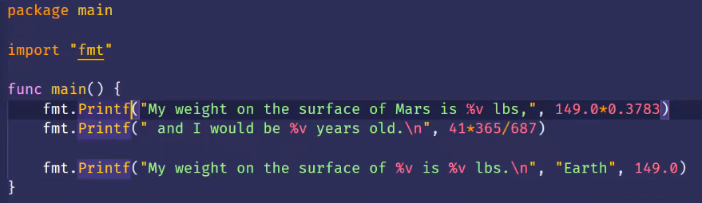

- [Go 算数运算符](#go-算数运算符)
	- [Go提供了+、-、*、/、%来做加减乘除和取余的算术运算。](#go提供了-来做加减乘除和取余的算术运算)
	- [位运算符](#位运算符)
- [输出](#输出)
	- [格式化打印](#格式化打印)
	- [使用Printf对齐文本](#使用printf对齐文本)
- [注释](#注释)
- [常量和变量](#常量和变量)
- [赋值运算符](#赋值运算符)
- [自增运算符](#自增运算符)
- [猜数](#猜数)
- [作业题](#作业题)
- [字符串格式化](#字符串格式化)
#### Go 算数运算符

##### Go提供了+、-、*、/、%来做加减乘除和取余的算术运算。

- exe1 

```go
package main
import (
	"fmt"
)
func practice01() {
	fmt.Println("This is practice_01!")
	fmt.Printf("This is %v\n", "Printf") // Print默认不换行
	fmt.Println("Hello world")
	fmt.Printf("This is %v * %v = %v\n", 1, 3, 1*3)
}
func practice02() {
	fmt.Print("My weight on the surface of Mars is ")
	fmt.Print(149.0 * 0.378)
	fmt.Print("lbs, and I would be ")
	fmt.Print(41 * 365 / 687)
	fmt.Println(" years old.")
	fmt.Println("My weight on the surface of Mars is ", 149.0*0.378, "lbs, and I would be ",
		41*365/687)
}
func main() {
	fmt.Printf("This is func %v\n ", "practice01")
	practice01()
	fmt.Printf("This is func %v \n ", "practice02")
	practice02()
}
```

#####  位运算符

```go
// 1.按位与运算 & 上下全为1，得1
r1 := 1 & 5
// 2.按位进行或运算 只要有1就得1
r2 := 1 | 5
// 3.按位进行异或运算 上下不同得1
r3 := 1 ^ 5
// 4.按位向左移动
r4 := 1 << 2
// 5.按位向右移动
r5 := 5 >> 1
// 6. 比较清除  以5为基准，让5的二进制和99的二进制位进行比较， 如果两个位置都为1，则将5的那个位置置0
r6 := 5 &^ 99
  5 -->  0000101
  99 --> 1100011
-->      0000100
```


#### 输出

- 内置函数
  - print
  - println

- fmt.Print，fmt.Println函数 
  - 可以传递若干个参数，之间用逗号隔开
  - 参数可以是字符串、数字、数字表达式等等。

  扩展：进程里有 stdin/stdout/stder'r

##### 格式化打印

- 可以使用Printf来控制打印的输出结果
- 与Print和Println不同，Printf的第一个参数必须是字符串
- 这个字符串里包含了像%v这样的格式化动词，它的值由第二个参数的值所代替。
- 如果指定了多个格式化动词，那么它们的值由后边的参数值按其顺序进行替换
- 

##### 使用Printf对齐文本

- 在格式化动词里指定宽度，就可以对其文本

  - 例如， %4v,就是向左填充到足够4个宽度

  - 正数，向左填充空格

  - 负数，向右填充空格

  - ```go
    package main
    import (
    	"fmt"
    )
    func main() {
    	fmt.Printf("This is func%4vbbbbbb\n", "aaa")
    	fmt.Printf("This is func%-4vaaaaa", "bbb")
    }
    This is func aaabbbbbb
    This is funcbbb aaaaa
    ```

#### 注释

- 单行注释 //
- 多行注释 /* 中间多行内容*/

#### 常量和变量

- const, 用来声明常量
  - 常量的值不可以改变
- var 用来声明变量
  - 想要使用变量首先需要声明

- 同时声明多个变量

```go
package main
import (
	"fmt"
)
// 定义多个变量
func vary_const_var() {
	const year, weight, hight = 24, 160, 170
	// var distance = 5600000
	// var speed = 100800
	// var (
	// 	distance = 5600000
	// 	speed    = 100800
	// )
	var distance, speed = 5600000, 108000
	fmt.Printf("I'm %v years old, and %v kg %vcm \n", year, weight, hight)
	fmt.Printf("need %v seconds\n", distance/speed)
	distance = distance - 100
	speed = speed - 100
	fmt.Print("need ", distance, "\n")
	fmt.Print("need ", speed)
}

func main() {
	vary_const_var()
}
```

#### 赋值运算符

```go
package main
import (
	"fmt"
)
func yunsuan() {
	var weight = 149.0
	var old = 24
	weight = weight * 0.3783
	fmt.Println("Weight", weight)
	weight *= 0.3782
	fmt.Println("wegiht", weight)
	old += 1
	fmt.Println("Old", old)
	old++
	fmt.Println("Old", old)
	old--
	fmt.Println("Old", old)
}

func main() {
    yunsuan()

}
```

#### 自增运算符

Go里面没有类似C#的 ++count这种操作

```go
func auto_increment() {
	var age = 24
	age = age + 1
	fmt.Println(age)
	age += 1
	fmt.Println(age)
	age++
	fmt.Println(age)
}
```

#### 猜数

- 使用 rand包，可以生成伪随机数
  - 例如，Intn可以返回一个指定范围的随机整数
  
  - import 的路径是 “math/rand”
  
    ```go
    func rand_num() {
    	rand.Seed(time.Now().Unix())
    	fmt.Println("output a num between 1 and 11")
    	var num = rand.Intn(10) + 1
    	fmt.Println(num)
    
    	num = rand.Intn(10) + 1
    	fmt.Println(num)
    	var num1 = rand.Intn(10) + 1
    	fmt.Println(num1)
    	fmt.Printf("%v + %v = %v \n", num, num1, add(num, num1))
    }
    
    func add(a, b int) int {
    	return a + b
    }
    ```

#### 作业题

- 编写程序来确定飞船要在28天内到达M的行进速度(公里/小时)假设距离为56，000，000公里.

  ```go
  package main
  import (
  	"fmt"
  
  func speed(distance, time float64) float64 {
  	return distance / time
  }
  func main() {
  	// vary_const_var()
  	// yunsuan()
  	// auto_increment()
  	// rand_num()
  	const distance = 56000000.0
  	const time = 28 * 24.0
  	fmt.Println("speed = ", speed(distance, time))
  }
  ```


#### 字符串格式化

将数据格式化为特定格式的字符串时，可以使用字符串格式化。

```go
var name, address, action string
fmt.Print(" 亲输入name ")
fmt.Scanln(&name)

fmt.Print(" 亲输入address ")
fmt.Scanln(&address)

fmt.Print(" 亲输入action ")
fmt.Scanln(&action)

result := fmt.Sprintf("我叫%s 在%s %s", name, address, action)
fmt.Println(result)
```


