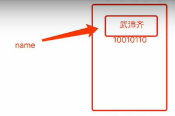
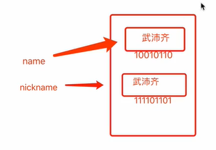
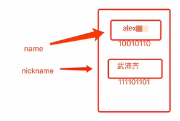

- [变量](#变量)
	- [变量名规范](#变量名规范)
	- [短声明](#短声明)
	- [注意事项：使用int、string、bool这三种类型时，如果遇到赋值就会重新拷贝一份。[值类型]](#注意事项使用intstringbool这三种类型时如果遇到赋值就会重新拷贝一份值类型)
- [作用域](#作用域)
	- [全局变量和局部变量](#全局变量和局部变量)
- [练习题](#练习题)
- [作业：展示随机日期](#作业展示随机日期)
	- [iota](#iota)
#### 变量

##### 变量名规范

1. 字母数字下划线组成
2. 数字不能开头
3. 不能和go中25个关键字重合

4. 建议
   1. 尽量见名知义
   2. 驼峰式命名，多个单词命名，使用驼峰式命名myBossName/startName

当变量被声明以后，它就进入了作用域(变量就变得可见了)

- 只要变量在作用域内，你就可以访问它
- 否则访问它会报错

变量声明的位置，决定了它的作用域

##### 短声明

在Go里，可以使用var来声明：

- var count =10

但是也可以使用短声明：

- count := 10

这两种方式的效果是一样的

因式分解，例如：声明5个变量，分别有字符串，整形，布尔型、浮点型

```go
var(
    name = "heyuyang"
    age = 24
    address string  // 默认值 ""
    male bool  // 默认值 false
    hight float64  // 只声明不赋值，会有一个默认值
    salary int // 默认值0
)
```

**Go编译器声明变量不使用，会报错**

不仅声明语句更短，而且可以在无法使用var的地方使用

- ```go
  package main
  import (
  	"fmt"
  	"time"
  )
  func main() {
  	fmt.Println("This is variable and scope")
  	// variable()
  	short_statment()
  }
  func short_statment() {
      // 短声明 count := 5 短声明只能在函数作用域内声明 不可在package作用域内声明
  	for count := 5; count > 0; count-- {
  		fmt.Println(count)
  		time.Sleep(time.Second)
  	}
      // var count = 0
  	// for count = 5; count > 0; count-- {
  		// fmt.Println(count)
  		// time.Sleep(time.Second)
  	// }
  }
  ```

例子: 在if语句里使用短声明来声明变量

- ```go
  import (
  	"fmt"
  	"math/rand"
  	"time"
  )
  func main() {
  	fmt.Println("This is variable and scope")
  	// variable()
  	// short_statment()
  	if_short_use()
  }
  func if_short_use() {
  	// var num = 0
  	rand.Seed(time.Now().Unix())
  	// if num = rand.Intn(3); num == 0 {
  	// 	fmt.Println(num)
  	// 	fmt.Println("Space Adventure")
  	// }
  	if num := rand.Intn(3); num == 0 {
  		fmt.Println(num)
  		fmt.Println("Space Adventures")
  	}
  }
  ```

例子：在switch语句里使用短声明来声明变量

- ```go
  package main
  import (
  	"fmt"
  	"math/rand"
  	"time"
  )
  func main() {
  	fmt.Println("This is variable and scope")
  	// variable()
  	// short_statment()
  	// if_short_use()
  	switch_short_use()
  }
  func switch_short_use() {
  	rand.Seed(time.Now().Unix())
  	var num = 2
  	switch num = rand.Intn(6) + 1; num {
  	case 1:
  		fmt.Println("this is num", num)
  	case 2:
  		fmt.Println("This is num ", num)
  	case 3:
  		fmt.Println("this is num", num)
  	case 4:
  		fmt.Println("this is num", num)
  	case 5:
  		fmt.Println("this is num", num)
  	default:
  		fmt.Println("not have num", num)
  	}
  }
  ```

##### 赋值及内存相关

示例1：

```go
name := "heyuyang"
name变量指向了内存中存储“heyuyang”的区域
```



示例2

```go
name := "heyuyang"
nickname := name // 会把数据拷贝一份
```



注意：这一点与python不同

示例3

```go
name := "heyuyang"
nickname := name
name = "hewuxin"
重新赋值会把内存中存储的值覆盖掉
```



##### 注意事项：使用int、string、bool这三种类型时，如果遇到赋值就会重新拷贝一份。[值类型]

```go
name := "heyuyang"
nickname := name
```
#### 作用域

##### 全局变量和局部变量

- 全局变量，未写在函数中的变量称为全局变量；不可以使用短声明声明；可以基于因式分解方式声明多个全局变量；项目中寻找变量的最后一环。
- 局部变量：写在{}内的变量，可以使用全部的声明方式。

在GO里面，作用域的范围就是{}之间的部分。

- 变量不能在上级大括号使用
- 可以在同级、子级大括号内使用
- 当自己没有该变量时，才会调用父级的该变量

- ```go
  package main
  
  import (
  	"fmt"
  	"time"
  )
  
  func main() {
  	fmt.Println("This is variable and scope")
  	variable()
  }
  
  func variable() {
      var count = 0  // count 的作用域就是variable(){}的大括号之间
  
  	for count < 10 {
  		fmt.Println(count)
  		count++
  		time.Sleep(time.Second)
  	}
  }
  ```

##### Package作业域

era变量是在main函数外声明的

- 它拥有package作用域
- 如果 main package 有多个函数，那么era对它们都可见

**短声明不可用来声明package作用域的变量**

```go
package main

import (
	"fmt"
	"math/rand"
	"time"
)
// 全局变量
var era = "AD"

func main() {
	fmt.Println("This is variable and scope")
	// variable()
	// short_statment()
	// if_short_use()
	// switch_short_use()
	date_show()
}

func date_show() {
	year := 2018
	rand.Seed(time.Now().Unix())
	switch month := rand.Intn(12) + 1; month {
	case 2:
		day := rand.Intn(28) + 1  // 这里短声明的作用域即为case内
		fmt.Println(era, year, month, day)
	case 4, 6, 9, 11:
		day := rand.Intn(30) + 1
		fmt.Println(era, year, month, day)
	default:
		day := rand.Intn(31) + 1
		fmt.Println(era, year, month, day)
	}
}
```

#### 练习题

```go
package main

import "fmt"

var number = 99

func main() {
	fmt.Println(number)
	number := 88
	if true {
		number = 123
		fmt.Println(number)
	}
	fmt.Println(number)
}
```

#### 作业：展示随机日期

修改程序，让其能处理闰年的情

- 生成随机年份，而不是写死2018

- 二月份： 闰年为29天，非闰年为28天

- 使用for循环生成和展示10个日期

- ```go
  package main
  import (
  	"fmt"
  	"math/rand"
  	"time"
  )
  var era = "AD"
  func main() {
  	randomdate_show()
  }
  func randomdate_show() {
  	for count := 10; count > 0; count-- {
  		// year := 2018
  		rand.Seed(time.Now().Unix())
  		year := rand.Intn(22) + 2001
  		month := rand.Intn(12) + 1
  		daysInmonth := 31
  		switch month {
  		case 2:
  			if year%400 == 0 || (year%4 == 0 && year%100 != 0) {
  				fmt.Printf("%v is leap year \n", year)
  				daysInmonth = 29
  			} else {
  				daysInmonth = 28
  			}
  		case 4, 6, 9, 11:
  			daysInmonth = 30
  		}
  		day := rand.Intn(daysInmonth) + 1
  		fmt.Println(era, year, month, day)
  		time.Sleep(time.Millisecond * 500)
  	}
  }
  ```

#### 常量

常量是不能被修改的变量, 当声明一个在项目中不会被修改的变量时，使用常量。

```go
const age int = 20 // 定义常量
const age = 20 
```

因式分解的方式

```go
const (
	age = 124
    name = "heyuyang "
	male bool = true
)
```

常量一般作为全局常量出现

##### iota

可有可无，当作声明常量时的计数器。

```go
const (
  v1 = iota
  v2
   v3
    v4
)
>>>>>>>>>>>>>
0 1 2 3 

const (
   v1 = iota + 2
    _
    v2
    v3
    v4
)
>>>>>>>>>>>>
2 4 5 6
```
