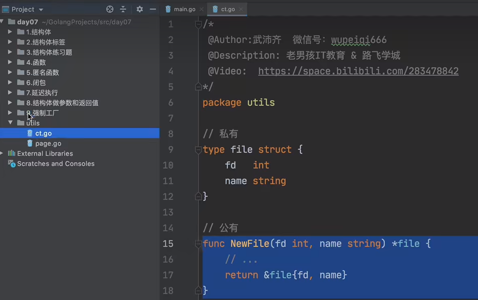
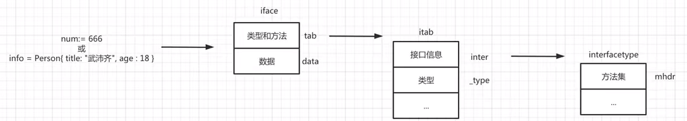

- [1. 字典类型（Map）](#1-字典类型map)
  - [1.1 声明&初始化](#11-声明初始化)
  - [1. 2 常用操作](#1-2-常用操作)
    - [1.2.1 长度](#121-长度)
    - [1.2.2 添加](#122-添加)
    - [1.2.3 修改](#123-修改)
    - [1.2.4 删除](#124-删除)
    - [1.2.5  查看](#125--查看)
    - [1.2.6 嵌套](#126-嵌套)
    - [1.2.7 变量赋值](#127-变量赋值)
  - [1.3 Map底层原理剖析](#13-map底层原理剖析)
    - [1.3.1 初始化](#131-初始化)
    - [1.3.2  写入数据](#132--写入数据)
    - [1.3.3 读取数据](#133-读取数据)
    - [1.3.4 扩容](#134-扩容)
    - [1.3.5 迁移](#135-迁移)
    - [翻倍扩容](#翻倍扩容)
    - [等量扩容](#等量扩容)
- [2. 指针](#2-指针)
  - [2.1 指针存在的意义](#21-指针存在的意义)
  - [3.2 指针的应用场景](#32-指针的应用场景)
  - [3.3 指针的指针](#33-指针的指针)
  - [3.4 指针高级小操作](#34-指针高级小操作)
- [3.结构体](#3结构体)
  - [3.1定义](#31定义)
  - [3.2初始化](#32初始化)
  - [3.3结构体指针](#33结构体指针)
    - [3.3.1 创建](#331-创建)
    - [3.3.2内存管理](#332内存管理)
  - [3.4赋值](#34赋值)
    - [3.4.1赋值拷贝](#341赋值拷贝)
    - [3.4.2 结构体指针赋值](#342-结构体指针赋值)
    - [3.4.3 嵌套赋值拷贝](#343-嵌套赋值拷贝)
    - [3.4.4 谁不拷贝](#344-谁不拷贝)
  - [3.5结构体标签](#35结构体标签)
  - [3.6 练习题](#36-练习题)
- [4.函数](#4函数)
  - [4.1参数](#41参数)
    - [4.1.1 多个参数](#411-多个参数)
    - [4.1.2 指针参数](#412-指针参数)
    - [4.1.3函数做参数](#413函数做参数)
    - [4.1.4 变长参数](#414-变长参数)
- [4.2函数返回值](#42函数返回值)
    - [4.2.1多个返回值](#421多个返回值)
    - [4.2.2返回函数](#422返回函数)
    - [4.2.3匿名函数&返回函数](#423匿名函数返回函数)
  - [4.3 闭包](#43-闭包)
####    1. 字典类型（Map）

字典（dict）或映射（map） 以键值对为元素的数据集合

```go
{
    "age": "18",
    "name": "何雨阳",
    "email": "hahahha@163.com"
}
```

这种数据类型的特点就是**查找速度非常快**，因为它的底层存储是**基于哈希表存储**的。

以`取模+拉链法`快速了解哈希表存储原理 


这种结构之所以快，是因为根据key可以直接找到数据存放的位置，而其他的数据类型是需要从前到后去注意对比，相对来说比较耗时。

以上只是基本的存储模型，各个编程语言中的字典都会在此基础上进行相应的修改和优化。

Map的特点：  

- 键不能重复
- 键必须可哈希（int/bool/float/string/array）
- 无序

##### 1.1 声明&初始化

```go
userInfo := map[string]string{}


userInfo := map[string]string{"name":"heyuyang", "age":"21"}

fmt.Println(userInfo["age"])

userInfo["name"] = "hewuxin"

userInfo["email"] = "hahaha@163.com"
```

```go
data := make(map[int]int, 10)

data := make(map[int]int)

data[11] = 111
data[22] = 222
data[333] = 33
```

```go
data := make(map[int]int)

data[11] = 111
data[22] = 222
data[333] = 33

// 声明 nil
var row map[int]int
// row[1] = 111  报错
row = data
```

```go
// 声明 nil
value := new(map[string]int)
// value["k1"] = 123 报错

data := make(map[string]int)
data["111"] = 111

value = &data  // 将data 的地址赋给value
```

注意：键不重复&键可哈希（int/float/string/array/bool)

```go
v1 := make(map[[2]int]float32)

v1[[2]int{1, 1}] = 1.6
v1[[2]int{1,2}] = 3.1

v2 := make(map[[2]int][3]int)
data = [2]int{1,1}
data1 = [3]int{1,2,3}
v2[data] = data1
```

##### 1. 2 常用操作

###### 1.2.1 长度

```go
data := map[string]string{"n1": "heyuyang", "n2": "hewuxin"}
value := len(data) // 2 计算map中键值对的个数
```

```go
// 根据参数值（10）， 计算出合适的容量
// 一个map中会包含很多桶， 每个桶中至少可以存储8个键值对。
info := make(map[string]string, 10)

info["n1"] = "heyuyang"
info["n2"] = "hewuxin"
v1 := len(info) // 2
// v2 := cap(info) // 报错
```

###### 1.2.2 添加

```go
data := map[string]string{"age": "18", "name": "heyuyang"}
data["email"] = "hahaha@163.com"
```

###### 1.2.3 修改

```go
data := map[string]string{"age": "18", "name": "heyuyang"}
data["age"] = "19"
```

###### 1.2.4 删除

```go
data := map[string]string{"age": "18", "name": "heyuyang"}
delete(data, "age")
```

###### 1.2.5  查看

```go
data := map[string]string{"age": "18", "name": "heyuyang"}

data["age"]


for key, value := range data{
    fmt.Println(key, value)
}

for key := range data{
    fmt.Println(key)
}

for _, value := range data{
    fmt.Println(value)
}
```

###### 1.2.6 嵌套

```go
v1 := make(map[string]int)
v2 := make(map[string]string)
v3 := make(map[string]...)
v4 := make(map[string][2]int)
v5 := make(map[string][]int)
v6 := make(map[string]map[string]string)
```

```go
v7 := make(map[string][2]map[string]string)
v7["n1"] = [2]map[string]string{{"name": "hewuxin", "age": "18"}, {"name": "hewuxin", "age": "20"}}
v7["n2"] = [2]map[string]string{{"name": "Hewuxin", "age": "8"}, {"name": "Hewuxin", "age": "201"}}

// 伪代码
v7 = {
    n1 : [
       {"name": "hewuxin", "age": "18"},
        {"name": "hewuxin", "age": "20"}
    ],
    n2 : [
        {"name": "Hewuxin", "age": "8"},
        {"name": "Hewuxin", "age": "8"}
    ]
}
```

前提：键不重复&键必须可哈希

```go
v8 := make(map[int]int)
v9 := make(map[string]int)
v10 := make(map[float32]int)
v11 := make(map[bool]int)
v12 := make(map[[2]int]int)
v13 := make(map[[]int]int) // 错误， []int 切片不可哈希
v14 := make(map[map[int]int]int) // 错误, 不可哈希
v15 := make(map[[2][]int]int) // 报错 
v16 := make(map[[2]map[string]string]int) // 报错
```

###### 1.2.7 变量赋值

```go
v1 := map[string]string{"n1": "heyuyang", "n2": "hewuxin"}
v2 := v1

v1["n1"] = "何雨阳"
fmt.Println(v1) // {"n1": "何雨阳", "n2": "hewuxin"}
fmt.Println(v2) // {"n1": "何雨阳", "n2": "hewuxin"}
```

注：无论是否存在扩容都指向同一个地址。

##### 1.3 Map底层原理剖析


Golang中的Map有自己的一套实现原理，其核心是由`hmap`和`bmap`两个结构体实现。

###### 1.3.1 初始化

```go
//初始化一个可容纳10个元素的map
// 源码 map.go 303行
info := make(map[string]string, 10)
```

- 第一步：创建一个hmap结构体对象。

- 第二步：生成一个哈希因子hash0 并赋值到hmap对象中（用于后续为key创建哈希值）。

- 第三步：根据hint=10，并根据算法规则来创建B，当前B应该为1。

- 第四步：根据B去创建桶（bmap对象）并存放在buckets数组中，当前bmap的数量应为2。

  - 当B<4时，根据B创建桶的个数的规则为：
    $$
    2^B(标准桶)
    $$

  - 当B>=4时，根据B创建桶的个数的规则为：
    $$
    2^B+2^{B-4}
    $$

  注意：每个bmap中可以存储8个键值对，当不够存储时需要使用溢出桶，并将当前bmap中的overflow字段指向溢出桶的位置。

###### 1.3.2  写入数据

```go
info["name"] = "何雨阳"
```

在map中写入数据时，内部的执行流程为：

- 第一步：结合哈希因子和键name生成哈希值`01111111111100011010101`

- 第二部：获取哈希值的`后B位`，并根据后B位的值来决定将此键值对存放到哪个桶中（bmap）。

  ```  
  将哈希值和桶掩码(B个为1的二进制)进行&运算，最终得到哈希值的后B位的值，假设当B为1时，其结果为0：
  哈希值：01111111111100011010100
  桶掩码：00000000000000000000001
  结果： 00000000000000000000000 = 0
  找桶的原则实际上是根据后B位的位运算计算出索引位置，然后再去buckets数组中根据索引找到目标桶（bmap）
  ```

- 第三步： 在上一步确定桶之后，接下来就是在桶中写入数据

  ```
  获取哈希值的tophash(即哈希值的高8位)，将tophash、key、value分别写入桶中的三个数组中。
  如果桶已满，则通过overflow找到溢出桶，并在溢出桶中继续写入。
  
  注意：以后在桶中查找时，会基于tophash来找（tophash相同再去比较key）。
  ```

- 第四步： hmap中的个数count++（map中的元素个数+1）

###### 1.3.3 读取数据

```go
value := info["name"]
```

在map中读取数据时，内部的执行流程为：

- 第一步：结合哈希因子和键`name`生成哈希值。

- 第二步： 获取哈希值的`后B位`，并根据后B位的值来决定此键值对存放在哪个桶中(bmap)。

- 第三步：确定桶之后，再根据key的哈希值计算出`tophash（高8位）`，根据tophash和key去桶中查找数据。

  ```
  如果当前桶没有找到，就根据overflow再去溢出桶中找，均未找到则表示key不存在。
  ```

###### 1.3.4 扩容

在向map中添加数据时，当达到某个条件，则会引发map扩容。

扩容条件：

- map中数据总个数/桶个数 >6.5, 引发翻倍扩容。
- 使用了太多的溢出桶时（溢出桶使用太多会导致map处理速度降低）。
  - B <= 15,已使用的溢出桶个数$ >= 2^B $,引发等量扩容。
  - B > 15, 已使用的溢出桶个数$ >= 2^{15} $时，引发等量扩容。


###### 1.3.5 迁移

扩容之后，必然要伴随着数据的迁移，即：将旧桶中的数据要迁移到新桶中。

###### 翻倍扩容

如果是翻倍扩容，那么迁移规则就是将旧桶中的数据分流至新的两个桶中（比例不定），并且桶编号的位置位：桶编号位置和翻倍后的对应编号位置。


如何实现这种迁移？

- 首先，要知道如果翻倍扩容(数据总个数/桶个数 > 6,5),则新桶个数是旧桶的2倍，即：map中B的值+1(因为同的个数等于 $ 2^B $, 而翻倍之后新桶的个数就是$ 2^B *2 $, 也就是$ 2^B+1 $, 所以`新桶的B的值=原桶B + 1`)。

- 迁移时会遍历某个旧桶中所有的key(包括溢出桶)，并根据key重新生成哈希值，根据哈希值的`低8位`来决定将此键值对分流到哪个新桶中。

  

扩容后，B的值在原来的基础上已加1，也就意味着通过多1位来计算此键值对要分流到新桶位置，如上图：

- 当新增的位(红色)的值为0，则数据会迁移到与旧桶编号一致的位置。
- 当新增的位(红色)的值为1，则数据会迁移到翻倍后对应编号位置。

例如：

```
旧桶个数为32个，翻倍后新桶的个数为64。
在重新计算旧桶中的所有key哈希值时，红色位只能是0或1，所以桶中的所有数据的后B位只能是以下两种情况：
  - 000111[7], 意味着要迁移到与旧桶编号一致的位置。
  - 100111[39], 意味着会迁移到翻倍后对应编号位置。
注意： 同一个桶中key的哈希值的低B位一定是相同的，不然不会放在同一个桶中，所以同一个桶中黄色标记的位都是相同的。
```

###### 等量扩容

如果是等量扩容（溢出桶太多引发的扩容），那么数据迁移机制就会比较简单，就是将旧桶（含溢出桶）中的值迁移到新桶中。

这种扩容和迁移的意义在于：当溢出桶比较多而每个桶的数据又不多时，可以通过等量扩容和迁移让数据更紧凑，从而减少溢出桶。

#### 2. 指针

指针是一种数据类型，用于表示数据的内存地址。 

```go
// 声明一个 字符串类型 的变量(默认初始化值为空字符串)
var v1 string

// 声明一个 字符串的指针类型 的变量(默认初始化值为nil)
var v2 *string
```

```go
// 声明一个 字符串类型的变量， 值为 何雨阳
var name string = "何雨阳"

// 声明一个 字符串的指针类型的变量 值为name对应的内存地址
var pointer *string = &name

var age int = 18

var x1 *int = &age
```


##### 2.1 指针存在的意义

相当于创建了一个地址的`引用`，以后根据这个引用获取它里面的值。


```go
v1 := "何雨阳"
v2 := &v1
fmt.Println(v1, v2, *v2) // 何雨阳 0xc0001021e0 何雨阳
// *v2 表示去取v2存的地址 地址内存的值
v1 = "hewuxin"
fmt.Println(v1, v2, *v2) // hewuxin 0xc0001021e0 hewuxin
```

##### 3.2 指针的应用场景

场景1：

```go
v1 := "heyuyang"
v2 := v1
v1 = "hewuxin"
fmt.Println(v1, v2) // hewuxin  heyuyang
```

```go
v1 := "heyuyang"
v2 := &v1
v1 = "hewuxin"
fmt.Println(v1, *v2) // hewuxin hewuxin
```


场景2：

```go
package main
import "fmt"

func changeData(data string){
    data := "哈哈哈"
}

func main(){
    name := "何雨阳"
    // 本质上会将name的值拷贝一份，并赋值给data
    changeData(name)
    fmt.Println(name) // 何雨阳
}
```

```go
package main
import "fmt"

func changeData(ptr *string){
    *ptr := "哈哈哈"
}

func main(){
    name := "何雨阳"
    changeData(&name)  // 这里传入的是name的地址传给ptr
    fmt.Println(name) // 哈哈
}
```

场景3：

```go
package main
import "fmt"

func main(){
    var username string
    fmt.Println("请输入用户名: ")
    fmt.Scanf("%s", &username)
    
    // 提示用户输入，当用户输入之后，将输入的值赋给内存地址对应的区域中。
    if username == "何雨阳"{
        fmt.Println("login successful!")
    }else{
        fmt.Println("login failure.")
    }
}
```

##### 3.3 指针的指针

```go
name := "何雨阳"

// 声明一个指针类型变量p1，内部存储name的内存地址
var p1 *string = &name

// 声明一个指针的指针类型变量p2，内部存储指针p1的内存地址
var p2 **string = &p1

// 声明一个指针的指针的指针类型变量p3，内部存储指针p2的内存地址
var p3 ***string = &p2
	fmt.Println(name, &name)
	fmt.Println(p1, &p1)
	fmt.Println(p2, &p2)
	fmt.Println(p3, &p3)
```


因为有指针的指针的存在，所以在使用指针进行重置时，也需要将相应的*号设置好，例如:

```go
package main

import "fmt"

func main(){
    name := "何雨阳"
    fmt.Println(name, &name)
	
    // 声明一个指针的指针类型变量p1，内部存储name的内存地址    
    var p1 *string = &name 
    fmt.Println("This is p1")
	fmt.Println(*p1, p1, &p1)
    *p1 = "张三"
    fmt.Println(*p1, p1, &p1)

    // 声明一个指针的指针类型变量p2，内部存储指针p1的内存地址
    var p2 **string = &p1
    fmt.Println("This is p2")
	fmt.Println(**p2, *p2, p2, &p2)
    **p2 = "啦啦"
    fmt.Println(**p2, *p2, p2, &p2)
    
    var p3 ***string = &p3
    fmt.Println("This is p3")
	fmt.Println(***p3, **p3, *p3, p3, &p3)
    ***p3 = "wodiu"  // 将name的内存中的值由 啦啦 改为wodiu
    fmt.Println(***p3, **p3, *p3, p3, &p3)
    
}
```

##### 3.4 指针高级小操作

- 数组的地址 == 数组的第一个元素的地址。

  

  ```go
  dataList := [3]int8{11, 22, 33}
  
  fmt.Printf("数组的地址为 %p; 数组的第一个元素的地址为 %p\n",&dataList, &dataList[0])
  // dataList 和&dataList[0] 的内存中存储的数据虽然相同，但他们是两个不同类型的指针。
  // &dataList *[3]int8
  // &dataList[0] *int8 
  ```

- 指针的计算

  ```go
  package main
  
  import (
   "fmt"
   "unsafe"
  )
  
  func main(){
      dataList := [3]int8{11, 22, 33}
      
      // 1.获取数组第一个元素的地址(指针)
      var firstDataPtr *int8 = &dataList[0]
      
      // 2. 转换成Pointer类型
      ptr := unsafe.Pointer(firstDataPtr)
      
      // 3. 转换成uintptr类型，然后进行内存地址的计算(即：地址加1个字符，意味着取第2个索引位置的值)
      targetAddress := uintptr(ptr) + 1
      // 4. 根据新地址，重新转成Pointer类型
      newPtr := unsafe.Pointer(targetAddress)
      
      // 5.Pointer对象转换成int8类型
      value := (*int8)(newPtr)
  
  	// 6.根据指针获取值
      fmt.Println("最终结果为：", *value)
  }
  ```

#### 3.结构体

什么是结构体？

> 结构体是一个复合类型，用于表示一组数据。
>
> 结构体由一系列属性组成，每个属性都有自己的类型和值。

```go
type Person struct{
    name string
    age int
    email string
}
//初始化
var p1 = Person("何雨阳", 19, "daxizang@163.com")

// 结构体取值
fmt.Println(p1.name, p1.age, p1.email)

p1.age = 20
fmt.Println(p1.name, p1.age, p1.email)
```

```go
type 结构体名称 struct {
    字段 类型
    ...
}
```

##### 3.1定义

```go
type Person struct {
    name string
    age int
    hobby []string
}
```

```go
type Address struct(){
    city,state string
    age int
}
```

```go
type Address struct {
    city, state string
}
type Person struct {
    name string
    age int
    ad Address
}
```

```go
type Address struct {
    city, state string
}
type Persom struct {
    name string
    age int
    Address // 匿名字段 Address Address
}
```

##### 3.2初始化

根据结构体创建一个对象。

```go
// 定义一个结构体（类型），每个结构体包含name、age、hobby三个元素
type Person struct{
	name string
	age int
    hobby []string
}

//方式1：先后顺序
var p1 = Person{"何雨阳", 19, []string{"ba", "soc"}}
fmt.Println(p1.name,p1.age, p1.hobby)

// 方式2：关键字
var p2 = Person{name:"何雨阳", age:18, hobby:[]string{"soc","ba"}}
fmt.Println(p1.name,p1.age, p1.hobby)

// 方式3：先声明再赋值
var p3 Person
p3.name = "heuwxin"
p3.age = 18
p3.hobby = []string{"soc", "ba"}
fmt.Println(p1.name,p1.age, p1.hobby)
```

```go
type Address struct{
    city,state string
    age int
}

//同上
```

```go
type Address struct{
     city, state string
}

type Person struct {
    name string
    age int
    ad Address
}

//方式1：先后顺序
var p1 = Person{"何雨阳", 19, Address{"北京", "china"}}
fmt.Println(p1.name,p1.age,p1.ad.city, p1.ad.state)


// 方式2：关键字
var p1 = Person{name:"hewuxin",age:19,ad:Address{"北京", "china"}}
fmt.Println(p1.name,p1.age,p1.ad.city, p1.ad.state)

// 方式3：先声明再赋值
var p3 Person
p3.name = "hewuxin"
p3.age = 19
p3.ad = Address{
    city:"beijing",
    state:"china"
}
fmt.Println(p3.name,p3.age,p3.ad.city, p3.ad.state)
```

```go
//定义一个结构体（类型），每个结构体包含name、age、hobby三个元素
type Address struct{
     city, state string
}

type Person struct {
    name string
    age int
    Address  // 匿名字段，那么默认Person就包含了Address的所有字段
}

//方式1：先后顺序
p1 := Person{"何雨阳", 19, Address{"北京", "china"}}
fmt.Println([1.name, p1.age, p1.city, p1.state])

//方式2：关键字
var p1 = Person{name:"hewuxin",age:19,Address:Address{"北京", "china"}}
fmt.Println(p1.name,p1.age,p1.ad.city, p1.ad.state, p1.Address.city, p1.Address.state)


//方式3：先声明再赋值
var p3 Person
p3.name = "hewuxin"
p3.age = 18
p3.Address = Address{
    city:"beijing",
    state:"china",
}
fmt.Println(p3.name, p3.age, p3.Address.city, p3.Address.state)
// 或
var p4 Person
p4.name = "hewuxin"
p4.age = 18
p4.city = "beijing"
p4.state = "china"
fmt.Println(p4.name, p4.age, p4.address.city, p4.address.state)
```

##### 3.3结构体指针

###### 3.3.1 创建

```go
type Person struct{
    name string
    age int
}

// 初始化结构体（创建一个结构体对象）
p1 := Person{"hewuxin", 18}
fmt.Println(p1.name, p1.age)

// 初始化结构体指针
// var p2 *Person  =&Person{"Hewuxin", 18}
p2 := &Person{"heuwxin", 18}
fmt.Println(p2.name, p2.age)

var p3 *Person = new(Person)
p3.name = "hewuxin"
p3.age = 18

fmt.Println(p3.name,p3.age)
```

###### 3.3.2内存管理

```go
type Person struct{
    name string
    age int
}

// 初始化结构体
p1 := Person{"hewuxin",18}
fmt.Println(p1.name, p1.age)

// 初始化结构体指针
p2 := &Person{"hewxin",18}
fmt.Println(p2.name, p2.age)
```


##### 3.4赋值

###### 3.4.1赋值拷贝 

```go
type Person struct{
    name string
    age int
}

p1 := Person{name:"hewuxin", age:18}
p2 := p1 // 内部将p1重新拷贝有1份

fmt.Println(v1) // {hewuxin 18}
fmt.Println(v2) // {hewuxin 18}

p1.name = "alex"
fmt.Println(v1) // {alex 18}
fmt.Println(v2)// {hewuxin 18}
```

###### 3.4.2 结构体指针赋值

```go
type Person struct{
    name string
    age int
}

p1 := &Person{name:"hewuxin", age:18}
p2 := p1 // p1 和p2 都保存的是 Person{name:"hewuxin", age:18}的地址

fmt.Println(v1) // &{hewuxin 18}
fmt.Println(v2) // &{hewuxin 18}

p1.name = "alex"
fmt.Println(v1) // &{alex 18}
fmt.Println(v2)// &{alex 18}
```

基于结合结构体和结构体指针的特性，基于指针实现数据变化后同步遍布。

```go
type Person struct{
    name string
    age int
}

p1 := Person{name:"hewuxin", age:18}
p2 := &p1

fmt.Println(p1) // {hewuxin 18}
fmt.Println(p2) // &{hewuxin 18}

p1.name = "heyuyang"

fmt.Println(p1) // {heyuxyag 19}
fmt.Println(p2) // &{heyuyang 19}
```


######  3.4.3 嵌套赋值拷贝

在存在结构体嵌套时，赋值会拷贝一份所有的数据。

```go
type Address struct{
    city,state string
}

type Person struct{
    name string
    age int
    address Address
}

p1:= Person{name:"hewuxin", age:18, address:Address{"beijing","china"}}
p2 := p1

fmt.Println(p1.address)
fmt.Println(p2.address)

p1.address.city = "shanghai"
fmt.Println(p1.address)
fmt.Println(p2.address)
```

###### 3.4.4 谁不拷贝

其实本质上都拷贝了，只不过由于数据存储方式的不同，导致**拷贝的有些是数据**，有些是**内存地址（指针）**

- 感觉拷贝：字符串、数组、整型等。
- 感觉不拷贝：map、切片。

```go
func structDemo10() {
	type Address struct {
		city, state string
	}
	type Person struct {
		name    string
		age     int
		hobby   [2]string
		num     []int
		parent  map[string]string
		address Address
	}
	p1 := Person{
		name:   "hey",
		age:    19,
		hobby:  [2]string{"ba", "soc"},                                // 拷贝
		num:    []int{1, 2, 3, 4, 5},                                  // 未拷贝  内部维护了指针指向数据存储的地方
		parent: map[string]string{"father": "sda", "mother": "dasda"}, // 未拷贝  内部维护了指针指向数据存储的地方
	}
	p2 := p1

	fmt.Println(p1)
	fmt.Println(p2)

	p1.hobby[0] = "dsad"
	fmt.Println(p1)
	fmt.Println(p2)

	p1.num[0] = 111111
	fmt.Println(p1)
	fmt.Println(p2)

	p1.parent["father"] = "aaaaaa"
	fmt.Println(p1)
	fmt.Println(p2)

	p1.address.city = "shanghai "
	fmt.Println(p1)
	fmt.Println(p2)
}
```

注意：对于那些默认拷贝的情况，可以改变为指针类型，让数据实现同步修改。

```go
func structDemo11() {
	type Address struct {
		city, state string
	}
	type Person struct {
		name    string
		age     int
		hobby   *[2]string
		num     []int
		parent  map[string]string
		address Address
	}
	p1 := Person{
		name:   "hey",
		age:    19,
		hobby:  &[2]string{"ba", "soc"},                               // 拷贝
		num:    []int{1, 2, 3, 4, 5},                                  // 未拷贝  内部维护了指针指向数据存储的地方
		parent: map[string]string{"father": "sda", "mother": "dasda"}, // 未拷贝  内部维护了指针指向数据存储的地方
	}
	p2 := p1

	fmt.Println(p1)
	fmt.Println(p2)

	p1.hobby[0] = "dsad"
	fmt.Println(p1)
	fmt.Println(p2)
}

```

##### 3.5结构体标签

```go
func structDemo12() {
   type Person struct {
      name string "姓名"
      age  int    "年龄"
   }

   p1 := Person{"heyuyang", 19}
   plType := reflect.TypeOf(p1)
   // 方式1
   field1 := plType.Field(0)
   fmt.Println(field1.Tag)
   //方式2
   field2, _ := plType.FieldByName("name")
   fmt.Println(field2.Tag)
   // 循环获取
   fieldNum := plType.NumField()
   for index := 0; index < fieldNum; index++ {
      filed := plType.Field(index)
      fmt.Println(filed.Name, filed.Tag)
   }
}
```

##### 3.6 练习题

###### 3.6.1 创建学校结构体，并添加到切片中。

创建一个学校的结构体，根据用户输入去创建学校（学校包含品牌和城市），然后将创建的学校信息动态添加到一个切片中。

###### 3.6.2创建班级，并展示班级信息。

1. 创建学校和班级的结构体，默认创建一个学校对象。

   ```go
   type School struct {
   	band, city string
   }
   
   func StructPractice01() {
   	var SchoolList []School
   
   	for {
   		var band, city string
   		fmt.Print("请输入band : ")
   		fmt.Scanf("%s \n", &band)
   		if band == "q" {
   			break
   		}
   		fmt.Print("请输入city: ")
   		fmt.Scanf("%s \n", &city)
   
   		sch := School{band: band, city: city}
   		SchoolList = append(SchoolList, sch)
   	}
   	for index, item := range SchoolList {
   		fmt.Println(index, item)
   	}
   
   }
   ```

2.  根据用户输入去创建班级（包含班级名称和人数），然后将创建的班级信息动态添加到一个切片中。

   <font color="red" size=5> 同时输入班级和学校为实现</font>

```go
type Class struct {
	title  string
	count  int
	school School
}
// ****************************************
func getInput(inputString *string) {
	stdin := bufio.NewReader(os.Stdin)
	count, err := fmt.Fscan(stdin, &inputString)
	stdin.ReadString('\n')
	if err != nil {
		fmt.Println(err)
		fmt.Printf("count:%d\n", count)
		fmt.Println("您的输入有误，请重新输入")
	}
}

func StructPractice02() {
	//1.创建学校
	var classList []Class

	//sch := School{band: "新东方", city: "beijing"}
	//2. 循环创建班级
	for {
		var sch School
		var class Class
		fmt.Printf("请输入班级title: ")
		fmt.Scanf("%s \n", &class.title)
		if class.title == "q" {
			break
		}

		fmt.Printf("请输入班级人数: ")
		fmt.Scanf("%s \n", &class.count)

		//
		fmt.Printf("请输入学校band: ")
		fmt.Scanf("%s \n", &sch.band)

		fmt.Printf("请输入学校city: ")
		fmt.Scanf("%s \n", &sch.city)
		class.school = sch
		// 加入到班级的列表(切片)
		classList = append(classList, class)

	}
	for _, item := range classList {
		message := fmt.Sprintf("%s %s 校区， %s 班级 有 %d 个学生", item.school.band, item.school.city,
			item.title, item.count)
		fmt.Println(message)
	}
}
```

##### <font color="red">3.7 for循环 两次scanf会跳过第二次</font>

[解决方法](<https://blog.csdn.net/m0_61472414/article/details/123635073)

#### 4.函数

用于实现某个功能，并且提高代码的重用性和可读性。

```go
func 函数名(参数) 返回值{
    
}
```

```go
func SendEmail(email string) bool {
    fmt.Println(email, "你有新邮件来了")
    return ture
}

func main(){
    result := SendEmail("daxinzang@163.com")
    if result{
        fmt.Println("发送成功")
    }else{
        fmt.Println("发送失败")
    }
}
```

关于函数名需要注意：函数名只能是字母数字下划线且数字不能开头。(驼峰式命名)

#####  4.1参数

###### 4.1.1 多个参数

```go
func func_demo() {
	fmt.Println("This is funcDemo")
}

func add(num1 int, num2 int) (int, bool) {
	result := num1 + num2
	return result, true
}

func funcDemo1() {
	data, flag := add(1, 8)
	fmt.Println(data, flag)
}
```

注意：传值时会拷贝一份数据（等同于赋值拷贝）

```go
func SendEmail(arg [2]int)  {
    arg[0] = 5
    fmt.Println(arg)
}

func main(){
    dataList = [2]int{1, 2}
    fmt.Println(dataList)
    SendEmail(email)
    fmt.Println(dataList)  //[1, 2]
} 

func SendEmail(arg []int)  {
    arg[0] = 5
    fmt.Println(arg)
}

func main(){
    dataList = []int{1, 2}
    fmt.Println(dataList)
    SendEmail(email)
    fmt.Println(d ataList)  //[5, 2]
} 
```

###### 4.1.2 指针参数

```go
func SendEmail(arg *[2]int)  {
    arg[0] = 5
    fmt.Println(arg)
}

func main(){
    dataList = [2]int{1, 2}
    fmt.Println(&dataList)
    SendEmail(email)
    fmt.Println(dataList)  //[5, 2]
} 
```

###### 4.1.3函数做参数

```go
func add100(num1 int, num2 int) (int, bool) {
	res := num1 + num2
	return res, true
}

func proxy(num1 int, num2 int, exec func(num1 int, num2 int) (int, bool)) int {
	data, flag := exec(num1, num2)
	if flag {
		return data
	} else {
		return data - 100
	}
}
func func_demo4() {
	fmt.Println("函数做参数传入函数")
	res := proxy(100, 200, add100)
	fmt.Println(res)
}
```

函数作为参数传入函数时，可以起别名传入

```go
func add100(num1 int, num2 int) (int, bool) {
	res := num1 + num2
	return res, true
}

type f1 func(num1 int, num2 int) (int, bool)

func sroxy(num1 int, num2 int, exec f1) int {
	data, flag := exec(num1, num2)
	if flag {
		return data
	} else {
		return 1
	}
}

func func_demo5() {
	fmt.Println("函数做参数传入函数")
	res := sroxy(1, 50, add100)
	fmt.Println(res)
}
```

###### 4.1.4 变长参数

```go
func doDemo(num ...int) int {
	fmt.Println(num)
	sum := 0
	for _, value := range num {
		sum += value
	}

	return sum
}

func funcDemo6() {
	fmt.Println("输入变长参数Demo")
	res1 := doDemo(1, 2, 3, 5)
	res2 := doDemo(0, 1, 1)

	fmt.Println(res1, res2)
}
```

注意事项：变长参数在一个函数中只能出现一次，而且当有多个参数时，变长参数只能放在最后

#### 4.2函数返回值

###### 4.2.1多个返回值

```go
func add101(arg int) (int, string, bool) {
	return arg + 100, "add101", true
}

func funcDemo7() {
	fmt.Println("函数返回值有多个Demo")
	v1, v2, v3 := add101(100)
	if v3 {
		message := fmt.Sprintf("add101 return %s, %d", v1, v2)
		fmt.Println(message)
	}
}
```

###### 4.2.2<font color="red">返回函数</font>

```go
func exec(num1 int, num2 int) int {
	res := num1 + num2
	fmt.Println("这是 exec函数")
	return res
}

func getFunction() func(int, int) int {
	return exec
}

func funcDemo8() {
	fmt.Println("This is funcDemo8 函数返回值为函数")
	// getFunction 返回的是函数 使用变量存储getFunction返回的函数
	function := getFunction()
	// 使用function 传入参数计算 return
	result := function(11, 22)

	fmt.Println(result)
}
```

###### 4.2.3<font color="red">匿名函数&返回函数</font>

```go
func F1(num1 int, num2 int)func(int)string{
	// 传入参数 num1 num2 int
	// 返回参数 func func传入参数int 返回参数string
	return func(num1 int)string{
		fmt.Println("匿名函数")
		return "匿名函数"
	}
}

func funcDemo9(){
	fmt.Println("This is funcDemo9 匿名函数")
	v1 := func(n1 int, n2 int)int {
		return 123
	}
	data := v1(12,13)
	fmt.Println("data: ", data)
	
	value := func(n1 int, n2 int)int{
		return 123
	}(11, 22)
	fmt.Println("value :", value)
	
	v3 := F1(11, 22)
	res := v3(5)
	fmt.Println("F1 return :", res)
}
```

```go
func droxy() func() int {
	// 通过使用droxy 调用 v1函数
	v1 := func() int {
		return 100
	}
	return v1
}

func funcDemo10() {
	fmt.Println("This is funcDemo10  使用函数作为函数的返回值")
	function := droxy() // function = v1

	result := function()
	fmt.Println("result: ", result)
}
```

##### 4.3 <font color="red">闭包</font> 

 通过函数将数据存储到函数中以便于以后利用这个值，将值包裹在包中。

```go
func funcDemo11() {

	// 存储着5个函数
	var functionList []func()

	for i := 0; i < 5; i++ {
		function := func() { // 函数内部的代码只有在执行函数时才执行
			fmt.Println(i)
		}
		functionList = append(functionList, function)
	}
	//运行函数前，循环已经执行完i=5
	functionList[0]() // 5
	functionList[1]() // 5
	functionList[2]() //

}
```

```go
func funcDemo12() {
	var functionList []func()

	for i := 0; i < 5; i++ {

		// 定义了匿名函数:传入参数 arg int 返回值 函数  函数为匿名函数 打印arg
		// 将i拷贝一份作为arg传入匿名函数
		function := func(arg int) func() {
			return func() {
				fmt.Println(arg)

			}
		}(i)
		functionList = append(functionList, function)
	}
	functionList[0]() // 0
	functionList[1]() // 1
	functionList[2]() // 2
}
```

##### 4.4 defer

用于在一个函数执行完成之后自动触发的语句，一般用于结束操作之后释放资源。

```go
func do() int {
	fmt.Println("函数开始执行")
	defer fmt.Println("函数执行完毕")
	fmt.Println("函数内容是sss")
	return 666
}

func funcDemo13() {
	fmt.Println("funcDemo13 defer 用于在一个函数执行完成之后自动触发的语句，一般用于结束操作之后释放资源")
	fmt.Println("在函数return之后/执行结束之前自动调用defer语句")
	ret := do()
	fmt.Println(ret)
}

```

注意：在函数return之后/执行结束之前自动调用defer语句。

**基于defer实现读写IO文件关闭**

当存在多个defer时，最终函数执行完毕后会按照 按照倒序的方式去执行。

```go
func fileIO() int {
	fmt.Println("feng chui")
	defer fmt.Println("函数执行完毕")
	defer fmt.Println("函。。。。。。")
	fmt.Println("pipiliang")
	return 666
}

func funcDemo14() {
	fmt.Println("funcDemo14 多个defer语句按编写顺序倒序执行")
	ret := fileIO()
	fmt.Println(ret)
}
```

也可以添加参数

```go
func after() int {
	fmt.Println("after 函数开始执行")
	defer do()
	fmt.Println("after 函数执行完毕")
	return 111
}

func funcDemo15() {
	fmt.Println("funcDemo15 defer 后面也可以跟函数 参数等")
	ret := after()
	fmt.Println(ret)
}
```

##### 4.5自执行函数

```go
func funcDemo16() {
	fmt.Println("funcDemo16 自动执行函数")
	result := func(arg int) int {
		return arg + 100
	}(100)
	fmt.Println(result)
}
```

#### 5.再看结构体

##### 5.1 结构体做参数和返回值

结构体做参数和返回值时，在执行时候都会被重新拷贝一份，如果不想被拷贝，则可以通过指针的形式进行处理。

```go
var P Person = Person{"heyuayng", 18}

func doSomething() Person {
	return P
}

func structDemo01() {
	fmt.Println("使用结构体作为参数和返回值时，结构体作为返回值返回时，会拷贝一份因此修改原值不会修改返回值")
	data := doSomething()
	fmt.Println(data)
	P.name = "hewuxin"
	fmt.Println("data: ", data)
	fmt.Println("P: ", P)
}
```

```go
type Person struct {
	name string
	age  int
}
var P Person = Person{"heyuayng", 18}

func doSomething01() *Person {
	return &P
}

func structDemo02() {
	fmt.Println("使用结构体指针作为返回值")
	data := doSomething01()
	fmt.Println(data)
	P.name = "hewuxin"
	fmt.Println("data: ", data)
	fmt.Println("P: ", P)
}
```

##### 5.2 类型方法

项目开发中可以为type声明的类型编写一些方法，从而实现`对象.方法`的操作。

```go
type MyInt int

func (i *MyInt) DoSomething(a1 int, a2 int) int {
	// 为MyInt类型自定义一个指针方法
	// 可以是指针/可以是类型： *MyInt MyInt
	return a1 + a2 + int(*i)
}

func Do(a1 int, a2 int) int {
	return a1 + a2
}

func (_ *MyInt) DoSomething01(a1 int, a2 int) int {
	// 为MyInt类型自定义一个指针方法
	// 可以是指针/可以是类型： *MyInt MyInt
	return a1 + a2
}

func structDemo03() {
	fmt.Println("项目开发中可以为type声明的类型编写一些方法，从而实现 对象.方法的操作。")
	var v1 MyInt = 1
	result := v1.DoSomething(1, 2)
	fmt.Println("result: ", result)

	var v2 MyInt = 2
	res := v2.DoSomething01(2, 3)
	fmt.Println("res: ", res)
}
```

结构体也是基于type声明的类型，所以也可以使用次方式为结构体定义一些方法。

   ```go
type People struct {
	name string
	age  int
	blog string
}

// 为People结构体类型自定义一个指针方法
// 注意：此处如果不是指针类型的话， 再执行方法时结构体对象就会被拷贝一份。
func (P *People) DoSomething02(a1 int, a2 int) int {
	return a1 + a2 + P.age
}

func structDemo04() {
	fmt.Println("注意：在方法名之前，func关键字之后的括号中指定receiver。如果方法不需要使用recv的值，可以使用_替换它。" +
		"recv就像是面向对象语言中的this或self，但是Go中并没有这两个关键字。可以使用this或self作为receiver的名字")
	p1 := People{name: "heyuyang", age: 18, blog: "https://www.pythonav.com"}
	result := p1.DoSomething02(1, 2)
	fmt.Println(result)
}
   ```

注意：在方法名之前，`func`关键字之后的括号中指定receiver。如果方法不需要使用`recv`的值，可以使用_替换它。`recv`就像是面向对象语言中的this或self，但是Go中并没有这两个关键字。可以使用`this`或`self`作为receiver的名字。

##### 5.3方法继承

如果结构体之前存在`匿名`嵌套关系，则`子结构体`可以继承`父结构体`中的方法。


如果son结构体中还有与其他结构体嵌套，那么他可以继承所有结构体中的方法。

##### 5.4结构体工厂

Go语言不支持面向对象编程语言中那样的构造方法，但是可以很容易的在Go中实现“构造方法”。为了方便通常会为类型定义一个工厂，按惯例，工厂的名字以new或New开头。假设定义了如下的File结构体类型： 

```go
type File1 struct {
	fd   int
	name string
}

type File struct {
	fd   int
	name string
}

func NewFile(fd int, name string) *File {
	return &File{fd, name}
}

func structDemo06() {
	fmt.Println("This is StructDemo06")
	message := " Go语言不支持面向对象编程的构造方法，但是可以很容易的在Go中实现“构造方法”。为了方便通常会为类型定义一个工厂，" +
		"按惯例，工厂的名字以New或new开头"
	fmt.Println("This is StructDemo06\n", message)
	f := NewFile(10, "./test.txt")
	fmt.Println(f.fd, f.name)
	f1 := File{10, "XXXXXX"}
	fmt.Println(f1.fd, f1.name)
}
```

在Go语言中常常像上面这样在工厂方法里使用初始化来简便的实现构造函数。

**强制使用工厂方法**，让结构体变为私有，工厂方法变为公有，这样强制所有代码在实例化结构体时都是用工厂方法。




#### 6.接口

Go语言中的接口是一种特殊的数据类型，定义格式如下：

```go
type 接口名称 interface{
    方法名称() 返回值
}
```

例如：

```go
type 接口名称 interface{}
	// 方法名称() 返回值
	// 接口中的方法只定义，不能编写具体的实现逻辑。
type Base interface {
	f1()                   //定义方法，无返回值
	f2() int               //定义方法，返回值int类型
	f3() (int, bool)       // 定义方法，2个返回值int和bool
	f4(n1 int, n2 int) int // 输入参数 int int 返回值int
}

type empty interface{}
```

接口中的方法只定义，不能编写具体的实现逻辑。

##### 6.1接口的作用

在程序开发中接口一般有两大作用：代指类型&约束。

###### 6.1.1 空接口，代指任意类型

```go
// 定义空接口
type Base1 interface{}

func interfaceDemo1() {
	//定义一个切片，内部可以存放任意类型.
    dataList := make([]Base1, 0) //推荐写为：dataList := make([]interface{}, 0)

	// 切片中添加 字符串类型
	dataList = append(dataList, "heyuyang")
	dataList = append(dataList, 11)
	dataList = append(dataList, 3.4)
	dataList = append(dataList, true)
	fmt.Println(dataList)
}

type interPerson struct {
	name string
	age  int
}

func someThing(arg interface{}) {

	fmt.Println(arg)
}

func interDemo1() {
	someThing("heyuyang")
	someThing(18)
	someThing("sex")
	someThing(true)
	someThing(4.15)
	someThing(interPerson{name: "heyuyang", age: 18})
}
```

由于接口只是代指这些数据类型（在内部其实是转换为了接口类型），想要再获取数据中的值时，需要再将接口转换为指定的数据类型。

```go
func someThing1(arg interface{}) {

	// 接口转换为Person成功，ok=true, 否则ok=false
	fmt.Println("arg 的类型: ", reflect.TypeOf(arg))
	tp, ok := arg.(interPerson)
	fmt.Println("arg.(interPerson)之后的 arg的类型: ", reflect.TypeOf(arg))
	if ok {
		fmt.Println(tp.name, tp.age)
	} else {
		fmt.Println("转换失败")
	}
}

func interDemo2() {
	fmt.Println("This is interDemo2 接口转换")
	someThing1(Person{name: "何雨阳", age: 24})
}

```

 ```go
type interPerson struct {
	name string
	age  int
}

type Role struct {
	title string
	count int
}

func something2(arg interface{}) {
    // 多个类型转换，将arg接口对象转换为。（断言）
	switch tp := arg.(type) {
	case interPerson:
		fmt.Println(tp.name)
	case Role:
		fmt.Println(tp.title)
	case string:
		fmt.Println(tp)
	default:
		fmt.Println(tp)
	}
}

func interDemo3() {
	something2(interPerson{"hewuxin", 24})
	something2(Role{"student", 18})
	something2("This is interDemo3")
	something2(true)

}
 ```

###### 6.1.2非空接口，规范&约束

一般定义非空接口，都是用于约束结构体中必须含有某个方法，例如：

示例1：

 ```go
// IBase 定义接口 返回值int
type IBase interface {
	f1() int
}

// IPerson 定义结构体Person
type IPerson struct {
	name string
}

// 为结构体IPerson定义方法
func (p IPerson) f1() int {
	return 123
}

type User struct {
	name string
}

func (p User) f1() int {
	return 666
}

// InterSomeThing 基于接口的参数，可实现传入多种类型（多态）,也同时具有约束对象必须实现接口方法的功能
func InterSomeThing(base IBase) {
	result := base.f1() // 直接调用 接口.f1() -> 找到其对应的类型并执行其方法
	fmt.Println(result)
}

func interDemo4() {
	per := IPerson{"hewxuin"}
	user := User{"student"}
	
	InterSomeThing(per)
    fmt.Println("per: ", per)
	fmt.Println("user: ", user)
	InterSomeThing(user)
}


// 为结构体定义方法
func (p *InterPerson) f1() int{
    return 123
}

func (p *User) f1() int{
    return 666
}

func main(){
    per := &Person{name:"hewuxin"} // 创建结构体对象并获取其指针对象
    user := &User{name: "heyuyang"}
    InterSomeThing(per)
    InterSomeThing(user)
}
 ```

###### 练习题

在项目中实现注册成功之后向用户发送：邮件、微信的消息提醒。

 ```go
package main

import "fmt"

type IMessage interface {
	send() bool
}

type Email struct {
	email   string
	content string
}

func (p *Email) send() bool {
	fmt.Println("发送邮件提醒：", p.email, p.content)
	return true
}

type WeChat struct {
	userName string
	content  string
}

func (p *WeChat) send() bool {
	fmt.Println("发送wechat提醒: ", p.userName, p.content)
	return true
}

func distribute(objectList []IMessage) {
	// 用户注册
	for _, item := range objectList {
		result := item.send()
		fmt.Println(result)
	}
}

func interfaceDemo(){
    messageObjectList := []IMessage{
        &Email{"daxinzang@163.com", "发送邮件"},
        &Wechat{"daxinzang@163.com", "发送邮件"},
    }
    distribute(messageObjectList)
}
 ```

##### 6.2  底层实现

###### 6.2.1 空接口 

接口是Go的一种数据类型，在上文也已经了解到Go的空接口可以代指任意类型，从而实现参数、“容器”中可以处理多种数据类型。

Go语言底层对空接口的实现：

```go
// 接口底层实现
// 空接口 接口是Go的一种数据类型，
type eface struct {
	_type *_type         // 存储类型相关信息
	data  unsafe.Pointer // 存储数据
}

```


如果在代码中出现`其他对象`赋值给空接口，其实就是将其他对象相关的值存放到eface的`_type`和`data`中，内部源码:

```go
// The conv and assert funcitons below do very similar thing.
// The convXXX functions are guaranteed by the compiler to succeed.
// The assertXXX functions may fail(either panicking or returning false),
// depending on whether they are 1-result or 2-result).
// The convXXX functions succeed on a nil input, whereas the assertXXX
// functions fail on a nil input.

func convT2E(t *_type, elem unsafe.Pointer)(e eface){
    if raceenabled{
        raceReadObjectPC(t, elem, getcallerpc(), funcPC(convT2E))
    }
    if msanenaled {
        msanread(elem, t.size)
    }
    x := mallocgc(t.size, t, true)
    // TODO: We allocate a zeroed object only to overwrite it with actual data.
    // Figure out how to avoid zeroing.Also below in convT2Eslice, convT2I, convT2Islice.
    typedmemmove(t, x, elem)
    e._type = t
    e.data = x
    return
}
```


注意：`_type`是一个结构体内部存储挺多的信息，这里统称为类型相关的信息。

示例1：

 

示例2：


示例3：


###### 6.2.2 非空接口

非空接口会定义一些方法来实现约束，所以在底层实现和空接口有些不同。

```go
type iface struct {
	tab *itab // 类型和方法
	data unsafe.Pointer  // 数据
}

type itab struct {
	inter *interfacetype // 接口信息，如：接口中定义的方法。
	_type *_type  // 类型
	hash uint32
	_    [4]byte
	fun  [1]uintptr
}

type interfacetype struct {
	type _type
	pkgpath name
	mhdr []imethod // 接口的方法
}
```

