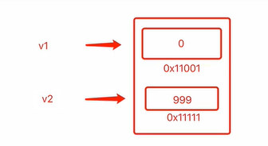
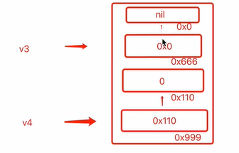

##### 指针

目的：节省空间

```go
var v3 *int  // 声明指针
v4 := new(int)  
```
##### 声明变量

```
var v1 int
v2 := 999 
```






##### new

```
new用于创建内存并进行内部数据的初始化，并返回一个指针类型。
```

##### nil

指go语言中的空值，

```go
var v100 *int
var v101 *int8
```


