#### 包

包其实就是指的封装了一些功能的类库，Go中的包主要分为三种：

- 内置包，安装Go自带的包。
- 第三方，通过go get ... 在github等地方下载的第三方包。
- 自定义，自己写的功能模块用包管理起来。

##### 1.1 fmt

fmt包提供了常见的输入和输出功能。

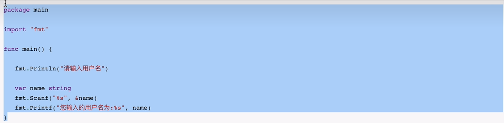

注意：fmt包中还有些其他功能，

##### 1.2 strcov

strcov的模块用于字符串和其他类型相关转换。

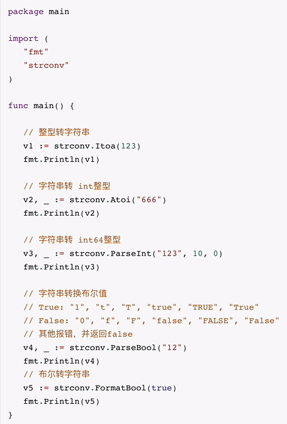

##### 1.3 json

```
JSON格式，本质上是一个字符串。
JSON包，让GO数据类型和JSON格式之间进行相互转换。
```

json包主要用于json数据的序列化和反序列化。

- Marshal，序列化
- Unmarshal，反序列化

示例1：

 **json序列化结构体 结构体字段名首字母必须得大写，小写获取不到**

```go
type jsonPerson struct {
	Name string
	Age  int
}

func jsonMarshalDemo() {
	fmt.Println("json序列化")
	v1 := []interface{}{
		"何雨阳",
		123,
		true,
		4.13,
		map[string]interface{}{
			"name": "hewuxin",
			"age":  18,
		},
		jsonPerson{"hewuxin", 666},
	}
	fmt.Println("原始数据", v1, reflect.TypeOf(v1))

	res, _ := json.Marshal(v1)
	fmt.Println("json序列化之后的数据: ", res)
	data := string(res)
	fmt.Println(data)
}
```

示例2：

```go
func jsonUnMarshalDemo() {
	fmt.Println("Json 反序列化")
	v1 := []interface{}{
		"何雨阳",
		123,
		true,
		4.13,
		map[string]interface{}{
			"name": "hewuxin",
			"age":  18,
		},
		jsonPerson{"hewuxin", 666},
	}
	fmt.Println("原始数据", v1, reflect.TypeOf(v1))

	res, _ := json.Marshal(v1)
	fmt.Println("json序列化之后的数据: ", res)
	var value []interface{}
	json.Unmarshal([]byte(res), &value)
	fmt.Println("反序列之后为： ", value)
}

>>>>>>>>>>>>>>
原始数据 [何雨阳 123 true 4.13 map[age:18 name:hewuxin] {hewuxin 666}] []interface {}                                                                                 
json序列化之后的数据:  [91 34 228 189 149 233 155 168 233 152 179 34 44 49 50 51 44 116 114 117 101 44 52 46 49 51 44 123 34 97 103 101 34 58 49 56 44 34 110 97 109 101 34 58 34 104 101 119 117 120 105 110 34 125 44 123 34 78 97 109 101 34 58 34 104 101 119 117 120 105 110 34 44 34 65 103 101 34 58 54 54 54 125 93]                
反序列之后为：  [何雨阳 123 true 4.13 map[age:18 name:hewuxin] map[Age:666 Name:hewuxin]] 
```

```go
type packageInfo struct {
	Title string
	Count int
}

type Address struct {
	City string `json:"city"`
	Num  int    `json:"num"`
}

type Container struct {
	Addr Address
	Inf  packageInfo
}

func packageDemo1() {
	v1 := Container{
		Address{"上海", 10010},
		packageInfo{"标题", 10010},
	}

	// 1.序列化
	res, _ := json.Marshal(v1) // 序列化获取的是[]byte字节切片，需要转换为字符串.
	result := string(res)

	fmt.Println("序列化的结果 result: ", result)

	// 2. 反序列化
	content := `["Addr":{"city":"上海", "num": 10010}, "Inf":{"Title": "标题", "Count": 10010}]`

	var dataObject Container
	json.Unmarshal([]byte(content), &dataObject)
	fmt.Println(dataObject)
	fmt.Println(dataObject.Addr)
	fmt.Println(dataObject.Inf)
}

```

在项目开发中，JSON一般用于网络请求之间的收发数据，例如：

```go
func packageDemo2() {
	// 1.像网络地址发送请求，并获取一段JSON格式数据。
	urlPath := "https://www.iedouyin.com/web/api/v2/aweme/iteminfo/item_id=6915066165949631752"
	req, _ := http.NewRequest("GET", urlPath, nil)
	req.Header.Add("User-Agent", "Mozilla/5.0 (Windows NT 10.0; Win64; x64) AppleWebKit/537.36 (KHTML, like Gecko)"+
		" Chrome/106.0.0.0 Safari/537.36")
	client := &http.Client{}
	res, _ := client.Do(req)

	body, _ := ioutil.ReadAll(res.Body)
	res.Body.Close()
	content := string(body)
	fmt.Println("接收到的返回值内容： ", content)

	// 2. 将JSON格式数据反序列化为GO数据类型
	var responseObject map[string]interface{}
	json.Unmarshal(body, &responseObject)
	fmt.Println(responseObject)
}
```

##### 1.4 time

 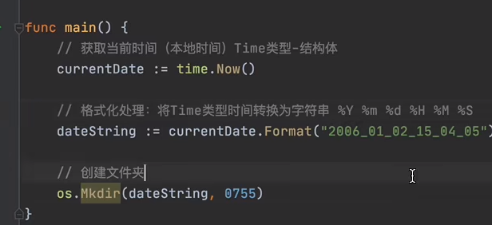

```go
func packageDemo4() {
	// 2. 获取当前UTC时间 t2.Local()
	t2 := time.Now().UTC()

	fmt.Println("当天UTC时间 (Time类型): ", t2)

	// 3.创建一个时间，字符串类型 -> Time类型
	t3, _ := time.Parse("2006-01-02", "2022-10-29")
	fmt.Println("根据字符串转换为时间(Time)类型 :", t3)

	// 4. 创建一个时间
	t4 := time.Date(2022, 10, 29, 21, 47, 11, 11, time.Local)
	fmt.Println("根据字符串转换为时间（Time类型）: ", t4)

	t5 := time.Date(2022, 10, 29, 21, 47, 11, 11, time.UTC)
	fmt.Println("根据字符串转换为时间（Time类型）: ", t5)

	// 5. 时间格式化，Time类型 -> 字符串类型
	fmt.Println("格式化之后的时间为（string）类型： ", t2.Format("2006-01-02 15:04:05.000000 -0700 MST"))

	// 6. 时间增加
	t6 := t2.Add(time.Hour * 1)
	fmt.Println("t2 is : ", t2)
	fmt.Println("当前时间加+1小时(time类型)", t6)

	// 7. 时间减小
	t7 := t2.Add(-time.Minute * 1)
	fmt.Println("当前时间-1分钟(time类型): ", t7)

	// 8.时间间隔
	t8 := t2.Sub(t4)
	fmt.Println("时间间隔为（Duratio类型）:", t8)

	fmt.Println("时间间隔小时: ", t8.Hours())
	fmt.Println("时间间隔分钟: ", t8.Minutes())
	fmt.Println("时间间隔秒: ", t8.Seconds())
}

```

##### 1.5 flag

基于os.Args可以获取传入的所有参数，例如：

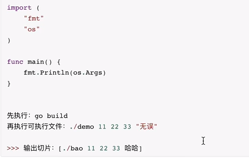

```go
import (
	"fmt"
    "os"
    "flag"
)
func packageDemo6() {
	fmt.Println("packageDemo6 从命令行获取参数 ")
	host := flag.String("h", "127.0.0.1", "主机名")
	port := flag.Int("p", 8080, "端口")

	var email string
	flag.StringVar(&email, "e", "", "邮箱")

	flag.Parse()
	fmt.Println(*port, *host, email)
}
```

##### 1.6 regexp

正则表达式的知识：

Go中正则相关的包：regexp的功能。

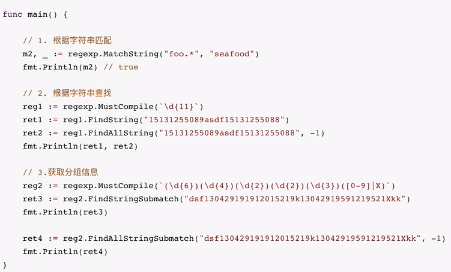

#### 2.文件及路径相关

文件路径相关的功能包含了：os、path、filepath、ioutil包。

##### 2.1创建文件夹

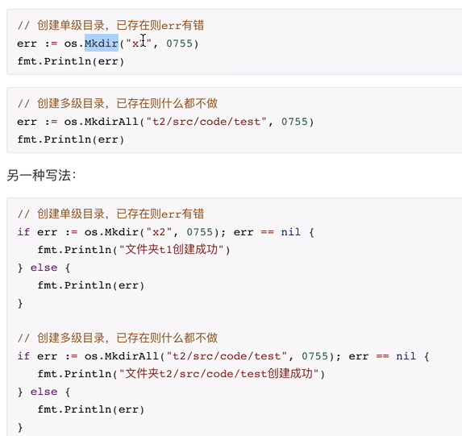

##### 2.2 删除文件和文件夹

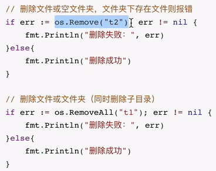

##### 2.3 路径是否存在

判断文件或文件夹是否存在

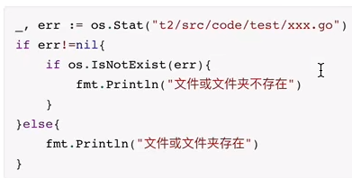

##### 2.4 是否是文件夹

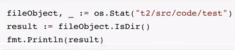

##### 2.5 生成绝对路径

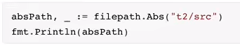

##### 2.6 获取上级目录

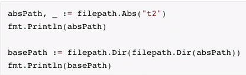

##### 2.7 遍历目录（一级）

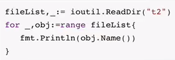

##### 2.8遍历目录（多级）

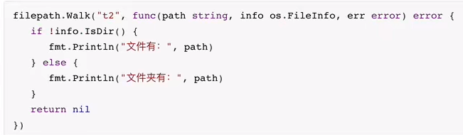

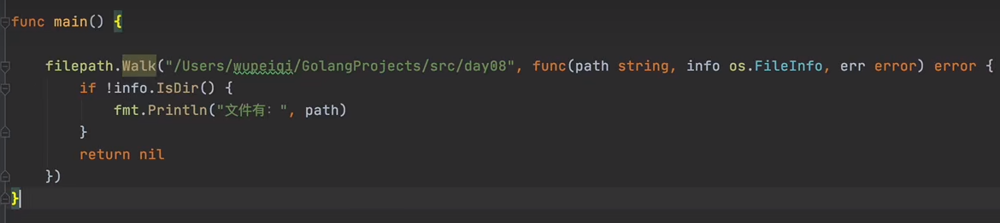

##### 2.9 路径拼接

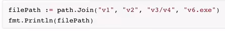

##### 2.10 文件扩展名

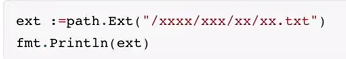