## Golang并发编程

### 协程

Golang中的`并发`是函数相互独立运行的能力。Goroutines是并发运行的函数。Golang提供了Goroutines作为并发处理操作的一种方式。

创建一个协程非常简单，就是在一个任务函数前面添加一个go关键字：

```go
go task()
```

#### 实例1

```go
package main

import (
	"fmt"
	"time"
)

func show(msg string) {
	for i := 1; i < 5; i++ {
		fmt.Printf("msg: %v \n", msg)
		time.Sleep(time.Millisecond * 100)
	}
}
>>>>

func RoutineTest() {
	go show("JAva")  // Go 启动一个协程来执行
	show("golang")  //在main协程中执行，如果他前面也添加go、程序没有输出

	fmt.Println("ending....")
}

func RoutineTest() {
	go show("JAva")  // Go启动第一个协程
	go show("golang")  // Go 启动第二个协程

	fmt.Println("ending....")  // 主函数执行完毕，就会杀死全部协程
}
```


#### 实例2

```go
func responseSize(url string) {
	fmt.Println("Step1: ", url)
	response, err1 := http.Get(url)
	if err1 != nil {
		log.Fatal(err1)
	}

	fmt.Println("Step2: ", url)

	defer response.Body.Close()

	fmt.Println("Step3: ", url)
	body, err2 := ioutil.ReadAll(response.Body)

	if err2 != nil {
		log.Fatal(err2)
	}

	fmt.Println("Step4: ", len(body))
}

func RoutineTest() {
	go responseSize("https://www.douban.com")
	go responseSize("https://baidu.com")
	go responseSize("https://jd.com")
	time.Sleep(10 * time.Second)
}
```

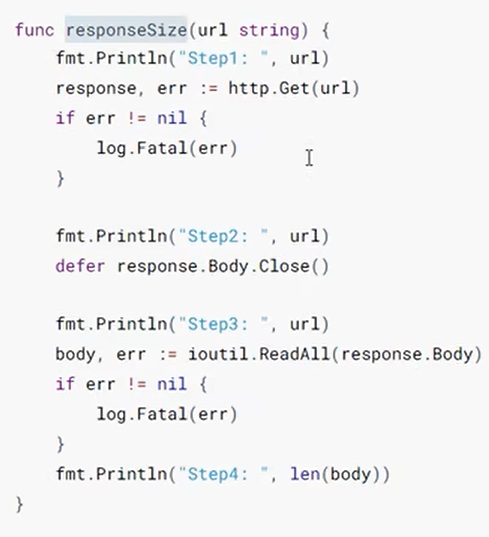

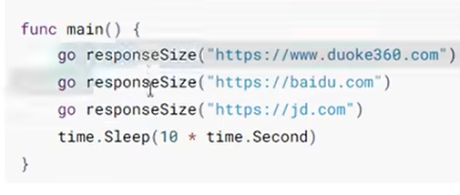

### 通道channel

Go提供了一种称为通道的机制，用于在foroutine之间<font color="red" size=5>共享数据</font>。当你作为goroutine执行并发活动时，需要在goroutine之间**共享资源或数据**，通道充当goroutine之间的管道（管道）并提供一种机制用来保证同步交换。

需要在**声明通道时指定数据类型**。我们可以共享内置、命名、结构和引用类型的值和指针。数据在通道上传递：<font color="red" size=5>在任何给定时间只有一个goroutine可以访问数据项：因此按照设计不会发生数据竞争</font>。

根据数据交换的行为，有两种类型的通道：无缓冲通道和缓冲通道。**无缓冲**通道用于执行goroutine之间的**同步通信**，而**缓冲通道**用于**执行异步通信**。无缓冲通道保证在发送和接受发生的瞬间执行两个goroutine之间的交换。缓冲通道没有这样的保证。

**通道由make函数创建，该函数指定chan关键字和通道的元素类型。**

#### 创建通道的代码块

**语法**

```go
Unbuffered := make(chan int) // 整型无缓冲通道
buffered := make(chan int, 10) // 整型有缓冲通道
```

使用内置函数`make`创建无缓冲和缓冲通道。`make`的第一个参数需要关键字`chan`，然后是通道允许交换的数据类型。

#### 这是将值发送到通道的代码块需要使用`<-`运算符

**语法**

```go
goroutine1 := make(chan string, 5) // 字符串缓存通道
goroutine1 <- "Australia"
```

一个包含5个值的缓冲区得字符串类型得goroutine1通道。然后我们通过通道发送字符串Australia。

##### 从通道接受值得代码块:

**语法**

```go
data := <-goroutine1 // 从通道接受字符串
```

`<-`运算符附加到通道变量(goroutine1)的左侧，以接受来自通道的值。

#### 无缓冲通道

在无缓冲通道中，在接受到任何值之前没有能力保存它。在这种类型的通道中，发送和接受goroutine在任何发送或接受操作完成之前的同一时刻都准备就绪。如果两个goroutine没有在同一时刻准备好，则通道会让执行其各自发送或接受操作的goroutine首先等待。同步是通道上发送和接收之间交互的基础。没有另一个就不可能发生。

#### 缓冲通道

在缓冲通道中，有能力在接受到一个或多个值之前保存它们。在这种类型的通道中，不要强制goroutine在同一时刻准备好执行发送和接收。当发送或接受阻塞时也有不同的条件。只有当通道中没有要接收的值时，接受才会阻塞。仅当没有可用缓冲区来放置正在发送的值时，发送才会阻塞。

#### 通道的发送和接受特性

1. 对于同一个通道，发送操作之间是互斥的，接受操作之间也是互斥的。
2. 发送操作和接受操作中对元素值的处理都是不可分割的。
3. 发送操作在完全完成之前会被阻塞。接收操作也是如此。

**例1**  send将value发送到channel  value 从通道读取值

```go
// 创建无缓冲通道，只能传入int类型值
var values = make(chan int)

func send() {
	// 设置随机数种子，加上这行代码，可以保证每次随机都是随机的
	rand.Seed(time.Now().UnixNano())
    value := rand.Intn(10) // 生成随机数
    fmt.Printf("send : %v \n", value)
    time.Sleep(time.Second)
    values <- value // 向通道写入value
}

func ChannelTest() {
	// 从通道接收值
	defer close(values) //当ChannelTest函数执行完成时关闭values通道
	go send()           // 开启协程执行send函数
	fmt.Println("wait...")
	value := <-values // 从values通道中获取值
	fmt.Printf("Recive: %v \n", value)
	fmt.Println("end...")
}
```

**例2 ** send每隔一秒写入一个值， fetch从channel中读取值

```go
// 定义无缓冲通道
var values = make(chan int)

func send() {
	// 设置随机数种子，加上这行代码，可以保证每次随机都是随机的
	rand.Seed(time.Now().UnixNano())
	for i := 0; i < 5; i++ {
		value := rand.Intn(10) // 生成随机数

		fmt.Printf("send : %v \n", value)

		time.Sleep(time.Second)

		values <- value // 向通道写入value

	}

}

func fetch() {
	for i := 0; i < 5; i++ {
		value := <-values // 从values通道中获取值
		fmt.Printf("Recive: %v \n", value)
	}
}

func ChannelTest() {
	// 从通道接收值
	defer close(values) //当ChannelTest函数执行完成时关闭values通道
	go send()           // 开启协程执行send函数
	fmt.Println("wait...")

	go fetch()
	time.Sleep(time.Second * 3)
	fmt.Println("end...")
}
```

### WaitGroup实现同步

**实例演示**

查看添加`WaitGroup`和不添加`WaitGroup`的区别

```go
func hello(i int) {
	defer wg.Done() // goroutine结束就登记-1
	fmt.Println("Hello Goroutine! ", i)
}
func WaitGroupTest() {
	for i := 0; i < 10; i++ {
		wg.Add(1) // 启动一个goroutine 就登记+1
		go hello(i)
	}
	wg.Wait() // 等待所有登记的goroutine都结束
}
```

```go
func showMsg(i int) {
	fmt.Printf("i: %v \n", i)
}

func WaitGroupTest1() {
	for i := 0; i < 10; i++ {
		// 启动一个协程来执行
		go showMsg(i)
	}
	// 主协程
	fmt.Println("end...")
}
```

```go
func showMsg(i int) {
	defer wg.Done() // 等价于 defer wg.Add(-1)
	time.Sleep(time.Second)
	fmt.Printf("i: %v \n", i)
}

func WaitGroupTest1() {
	for i := 0; i < 10; i++ {
		// 启动一个协程来执行
		go showMsg(i)
	}
	// 主协程
	defer fmt.Println("end...")
	wg.Wait() // 等待所有登记的goroutine都结束
}
```

### runtime包

runtime包里面定义了一些协程管理相关的api

#### runtime.Gosched()

让出CPU时间片，重新等待安排任务

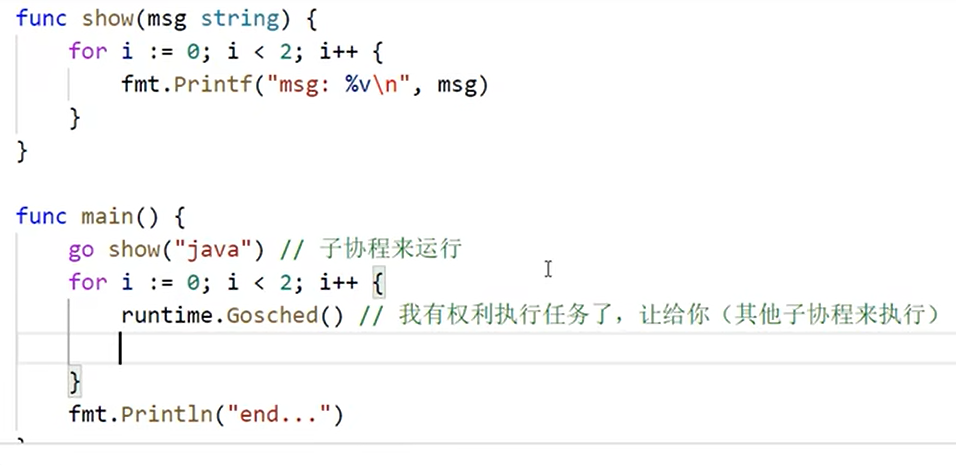

#### runtime.Goexit() 

退出当前协程

```go
func show() {
	for i := 0; i < 10; i++ {
		fmt.Printf("i: %v\n", i)

		if i >= 5 {
			runtime.Goexit()
		}
	}

}

func GoexitTest() {

	go show()

	time.Sleep(time.Second)
}
```

#### runtime.GOMAXPROCS

最大核心数 

```go
func a() {
	for i := 0; i < 10; i++ {
		fmt.Println("A: ", i)
	}
}

func b() {
	for i := 0; i < 10; i++ {
		fmt.Println("B: ", i)
	}
}
func GoMaxProcsTest() {
	fmt.Printf("runtime.NumCPU(): %v \n", runtime.NumCPU())
	runtime.GOMAXPROCS(1)
	go a()
	go b()
	time.Sleep(time.Second)
}
```

```go
package main

import (
	"fmt"
	"runtime"
	"time"
)

/*
func show(msg string) {
	for i := 0; i < 2; i++ {
		fmt.Printf("msg: %v\n", msg)
	}
}
func GoschedTest() {
	go show("Golang")
	for i := 0; i < 2; i++ {
		runtime.Gosched() // 有权利执行任务，让给其他子协程执行
	}
	fmt.Println("ending...")
}
*/
/*
func show() {
	for i := 0; i < 10; i++ {
		fmt.Printf("i: %v\n", i)

		if i >= 5 {
			runtime.Goexit()
		}
	}

}

func GoexitTest() {

	go show()

	time.Sleep(time.Second)
}
*/

func a() {
	for i := 0; i < 10; i++ {
		fmt.Println("A: ", i)
	}
}
func a1() {
	for i := 0; i < 10; i++ {
		fmt.Println("a: ", i)
		time.Sleep(time.Millisecond * 100)
	}
}

func b() {
	for i := 0; i < 10; i++ {
		fmt.Println("B: ", i)
	}
}

func b1() {
	for i := 0; i < 10; i++ {
		fmt.Println("b: ", i)
		time.Sleep(time.Millisecond * 100)
	}
}

func GoMaxProcsTest() {
	fmt.Printf("runtime.NumCPU(): %v \n", runtime.NumCPU())
	runtime.GOMAXPROCS(1)
	go a()
	go a1()
	go b()
	go b1()
	time.Sleep(time.Second)
}
```

### Mutex互斥锁实现同步

除了使用channel实现同步之外，还可以使用Mutex互斥锁的方式实现同步。

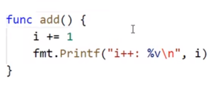

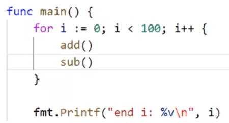

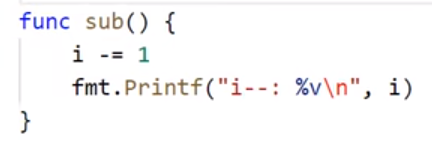

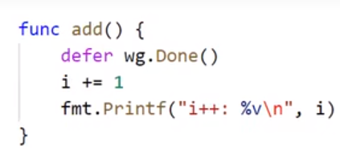

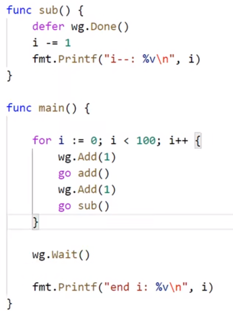

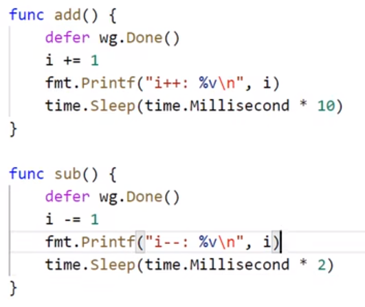

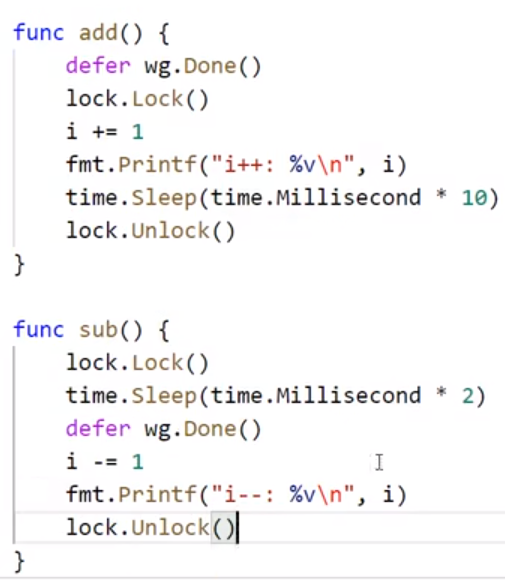

### channel的遍历

#### 方法1 for循环+if判断

```go
func ChannelTest01() {
	c := make(chan int) // 注册无缓冲通道

	go func() {
		for i := 0; i < 10; i++ {
			fmt.Println("将", i, "写入通道")
			c <- i // 向通道写入数据
		}
		close(c) // for循环写入完毕时关闭通道
	}()

	for {
		// 从通道中读取数据  死循环读取 如果读到值就打印，不然就跳出循环
		if data, ok := <-c; ok {
			fmt.Printf("data : %v \n", data)
		} else {
			break
		}
	}
}

func ChannelTest02() {
	c := make(chan int)

	go func() {
		for i := 0; i < 2; i++ { //
			fmt.Println("将", i, "写入通道")
			c <- i
		}
		close(c)
	}()

	for i := 0; i < 3; i++ {
		r := <-c //  如果int通道中没有值 会读到默认值0
		fmt.Printf("r: %v \n", r)
	}
}
```

#### 方法2 for range

```go
func ChannelTest03() {
	c := make(chan int)
	go func() {
		for i := 0; i < 10; i++ {
			c <- i
		}
		close(c)
	}()

	for v := range c {
		fmt.Printf("v: %v\n", v)
	}
}
```

注意：如果通道关闭，读多写少，没有了就是默认值，例如， int就是0，如果没有关闭就会死锁。

### select switch

1. select是Go中的一个控制结构，类似于`switch`语句， 用于处理异步IO操作。 `select`会监听case语句中channel的读写操作，当case中channel读写操作为非阻塞状态(即能读写)时，将会触发相应的动作。

   > select中的case语句必须是一个channel操作
   >
   > select中的default语句总是可运行的。

2. 如果有多个`case`都可以运行,`select`会随机公平的选出一个执行，其他不会执行。

3. 如果没有可运行的`case`语句，且有`default`语句，那么就会执行`default`的动作。

4. 如果没有可运行的`case`语句，且没有`default`语句，`select`将阻塞，直到某个`case`通信可以运行。

#### 实例

```
package main

import (
   "fmt"
   "time"
)

var chanInt = make(chan int) //
var chanStr1 = make(chan string)

func SelectTest() {
   go func() {
      chanInt <- 100      // 将100写入通道
      chanStr1 <- "hello" // 将hello写入通道
      close(chanInt)
      close(chanStr1)
   }()

   for {
      select {
      case r := <-chanInt:
         fmt.Printf("chanInt: %v\n", r)
      case r := <-chanStr1:
         fmt.Printf("chanStr: %v\n", r)
      default:
         fmt.Println("default....")
      }
      time.Sleep(time.Second)
   }

}
```

### Timer

定时器，可以实现一些定时操作，定时器内部也是通过channel来实现的。

**实例演示**  

#### Timer.NewTimer

```go
func NewTimerTest() {
	timer := time.NewTimer(time.Second * 2)
	fmt.Printf("time.Now(): %v\n", time.Now())
	t1 := <-timer.C // 阻塞的，指定时间到了
	fmt.Printf("t1 : %v \n", t1)
}

func NewTimerTest1() {
	fmt.Printf("time.Now(): %v \n", time.Now())
	timer := time.NewTimer(time.Second * 2)
	<-timer.C
	fmt.Printf("time.Now(): %v\n", time.Now())
}
>>>>>>>>>>>>>>>>>>>>>>>>>
time.Now(): 2022-11-04 20:26:47.9227226 +0800 CST m=+0.005769401
time.Now(): 2022-11-04 20:26:49.9421663 +0800 CST m=+2.025213101
```

#### Timer.After

```go
func TimerAfterTest() {
	<-time.After(time.Second * 2)
	fmt.Println("......")
}

func TimerAfterTest1() {
	timer := time.NewTimer(time.Second)
	go func() {
		<-timer.C
		fmt.Println("func....")
	}()

	time.Sleep(time.Second * 3)
	fmt.Println("main end...")
}
```

#### timer.Stop()

```go
func TimerStop() {
	timer := time.NewTimer(time.Second)
	go func() {
		<-timer.C
		fmt.Println("func......")
	}()

	s := timer.Stop()
	if s {
		fmt.Println("stop....")
	}
}
```

#### Timer.Reset

```go
func TimerReset() {
	fmt.Println("before")
	timer := time.NewTimer(time.Second * 5) // 原来设置5s
	timer.Reset(time.Second * 1)            // Reset修改为1秒
	<-timer.C
	fmt.Println("After")
}
```

###  Ticker

Timer只执行一次，Ticker可以周期的执行。

#### NewTicker

  ```go
func TimerTicker() {
	fmt.Println("Timer 只执行一次，Ticker可以周期的执行.")
	ticker := time.NewTicker(time.Second)
	counter := 1

	for _ = range ticker.C {
		fmt.Println("ticker....")
		counter++
		if counter >= 5 {
			ticker.Stop()
			break
		}
	}
}
  ```

```go
func TimerTicker1() {
	chanInt := make(chan int)

	ticker := time.NewTicker(time.Second)

	go func() {
		for _ = range ticker.C {
			select {
			case chanInt <- 1:
			case chanInt <- 2:
			case chanInt <- 3:
			}
		}
	}()

	sum := 0
	for v := range chanInt {
		fmt.Printf("接受: %v \n", v)
		sum += v
		if sum >= 10 {
			fmt.Printf("sum: %v\n", sum)
			break
		}
	}
}
```

### 原子变量的引入

atomic 提供的原子操作能够确保任一时刻只有一个goroutine对变量进行操作，善用atomic能够避免程序中出现大量的锁操作。

atomic常见操作有：

- 增减
- 载入read
- 比较并交换 cas
- 交换
- 存储write

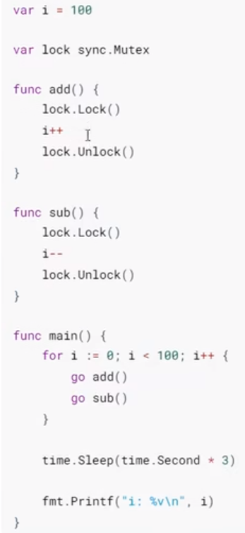

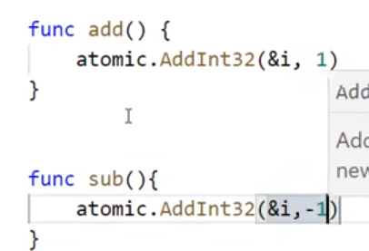

#### 增减操作

atomic包提供了如下以Add为前缀的增减操作

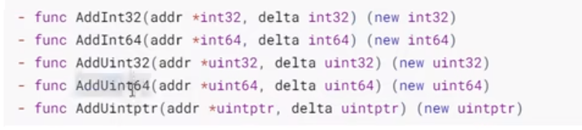

#### 载入操作

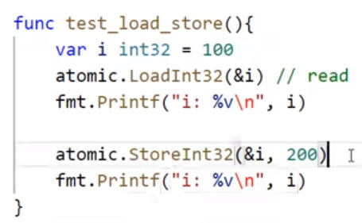

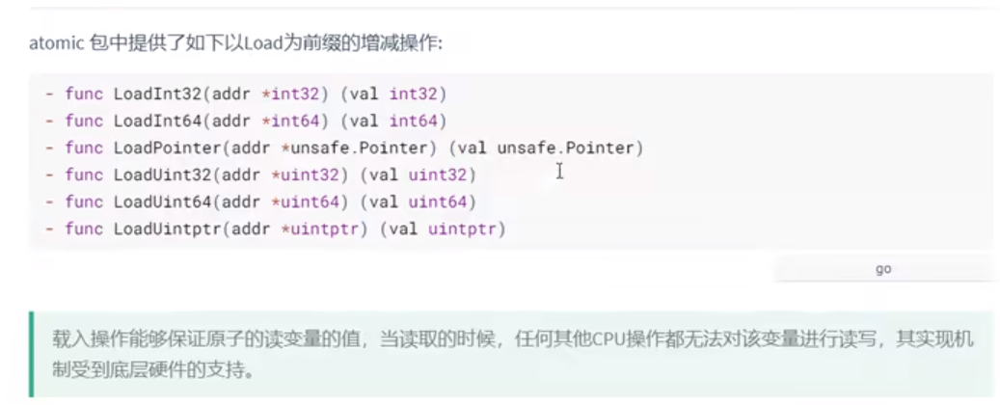

#### cas

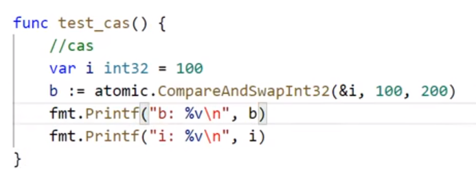

#### 交换

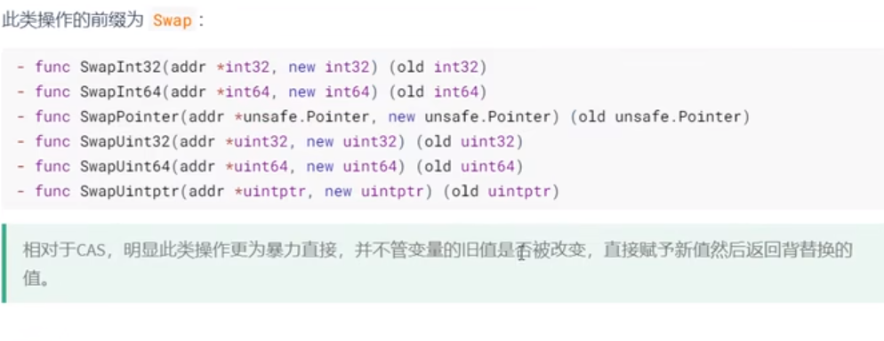

#### 存储

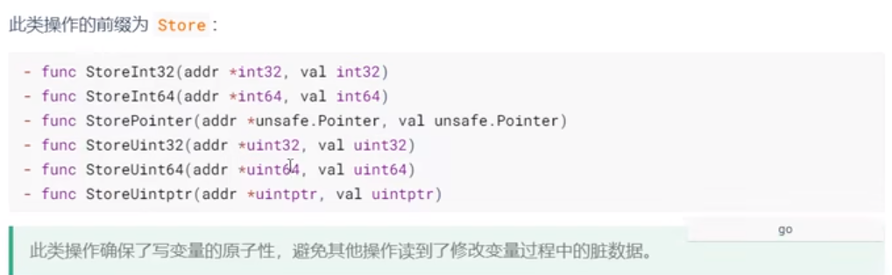