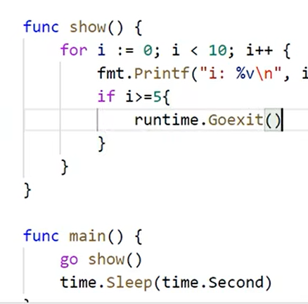

## Golang并发编程

### 协程

Golang中的`并发`是函数相互独立运行的能力。Goroutines是并发运行的函数。Golang提供了Goroutines作为并发处理操作的一种方式。

创建一个协程非常简单，就是在一个任务函数前面添加一个go关键字：

```go
go task()
```

#### 实例1


#### 实例2


### 通道channel

Go提供了一种称为通道的机制，用于在foroutine之间<font color="red" size=5>共享数据</font>。当你作为goroutine执行并发活动时，需要在goroutine之间**共享资源或数据**，通道充当goroutine之间的管道（管道）并提供一种机制用来保证同步交换。

需要在**声明通道时指定数据类型**。我们可以共享内置、命名、结构和引用类型的值和指针。数据在通道上传递：<font color="red" size=5>在任何给定时间只有一个goroutine可以访问数据项：因此按照设计不会发生数据竞争</font>。

根据数据交换的行为，有两种类型的通道：无缓冲通道和缓冲通道。**无缓冲**通道用于执行goroutine之间的**同步通信**，而**缓冲通道**用于**执行异步通信**。无缓冲通道保证在发送和接受发生的瞬间执行两个goroutine之间的交换。缓冲通道没有这样的保证。

**通道由make函数创建，该函数指定chan关键字和通道的元素类型。**

#### 创建通道的代码块

**语法**

```go
Unbuffered := make(chan int) // 整型无缓冲通道
buffered := make(chan int, 10) // 整型有缓冲通道
```

使用内置函数`make`创建无缓冲和缓冲通道。`make`的第一个参数需要关键字`chan`，然后是通道允许交换的数据类型。

#### 这是将值发送到通道的代码块需要使用`<-`运算符

**语法**

```go
goroutine1 := make(chan string, 5) // 字符串缓存通道
goroutine1 <- "Australia"
```

一个包含5个值得缓冲区得字符串类型得goroutine1通道。然后我们通过通道发送字符串Australia。

##### 从通道接受值得代码块:

**语法**

```go
data := <-goroutine1 // 从通道接受字符串
```

`<-`运算符附加到通道变量(goroutine1)的左侧，以接受来自通道的值。

#### 无缓冲通道

在无缓冲通道中，在接受到任何值之前没有能力保存它。在这种类型的通道中，发送和接受goroutine在任何发送或接受操作完成之前的同一时刻都准备就绪。如果两个goroutine没有在同一时刻准备好，则通道会让执行其各自发送或接受操作的goroutine首先等待。同步是通道上发送和接收之间交互的基础。没有另一个就不可能发生。

#### 缓冲通道

在缓冲通道中，有能力在接受到一个或多个值之前保存它们。在这种类型的通道中，不要强制goroutine在同一时刻准备好执行发送和接收。当发送或接受阻塞时也有不同的条件。只有当通道中没有要接收的值时，接受才会阻塞。仅当没有可用缓冲区来放置正在发送的值时，发送才会阻塞。

#### 通道的发送和接受特性

1. 对于同一个通道，发送操作之间是互斥的，接受操作之间也是互斥的。
2. 发送操作和接受操作中对元素值的处理都是不可分割的。
3. 发送操作在完全完成之前会被阻塞。接收操作也是如此。


### WaitGroup实现同步

**实例演示**

查看添加`WaitGroup`和不添加`WaitGroup`的区别


### runtime包

runtime包里面定义了一些协程管理相关的api

#### runtime.Gosched()

让出CPU时间片，重新等待安排任务


#### runtime.Goexit() 

退出当前协程



#### runtime.GOMAXPROCS

最大核心数 


