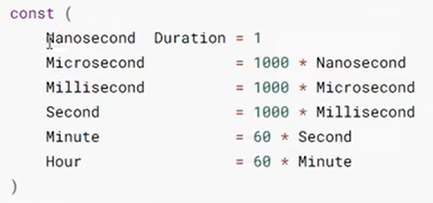

### 1.errors

errors包实现了操作错误的函数。Go语言使用error类型来返回函数执行过程中遇到的错误，如果返回的error值为nil，则表示未遇到错误，否则error会返回一个字符串，用于说明遇到了什么错误。

#### error结构

```go
type error interface {
    Error() string
}
```


可以使用任何类型去实现它(只要添加一个Error()方法即可，) 也就是说，error可以是任何类型，这意味着，函数返回的eror值实际可以包含任意信息，不一定是字符串。

error不一定表示一个错误，它可以表示任何信息，比如io包中就用error类型的`io.EOF`表示数据读取结束，而不是遇到了什么错误。

errors包实现了一个最简单的error类型，只包含了一个字符串，它可以记录大多数情况下遇到的错误信息。errors包的用法很简单，只有一个New函数，用于生成一个最简单的error对象：

```go
func New(text string) error
```


####  自定义错误


### 2. sort

#### sort包的内容，以及使用

sort包提供了排序切片和用户自定义数据集以及相关功能的函数。

sort包主要针对`[]int`、`[]float64`，`[]string`、以及其他**自定义切片**的排序。


查看sort.go 

#### 结构体

```go
type IntSlice struct []int
type Float64Slice
type StringSlice
```

#### 函数


#### 接口 type Interface


#### 实例


#### 结构体结合实例

三种结构体的方法都是一样的，只是分别针对int切片、float64切片，strings切片这三种不同的类型。

然后三种结果都有五个公开方法


 

**string**


**复杂结构: `[][]int`** 


**复杂结构体: []map[string]int**  **[{"k":0}, {"k":1}, {"k": 2}]:**


**复杂结构体: []struct: **


### 3.time

time包提供测量和显示时间的功能。

#### 基本使用

打印显示出现在的时间，基本示例如下。

其中now为time.Time类型，Month为time.Month类型

```go
func TimeTest01() {
	t := time.Now()
	fmt.Printf("t: %T \n", t)
	fmt.Printf("t: %T \n", t)

}
```

```go
func TimeTest02() {
	fmt.Println("打印显示出现在得时间， 其中now为time.Time类型， Month为time.Month类型")
	now := time.Now() // 获取当前时间
	fmt.Printf("current time : %v\n", now)

	year := now.Year()
	month := now.Month()
	day := now.Day()
	hour := now.Hour()
	minute := now.Minute()
	second := now.Second()

	fmt.Printf("%d-%02d-%02d %2d:%2d:%2d\n", year, month, day, hour, minute, second)
	fmt.Printf("%T, %T,%T,%T,%T,%T,%T\n", now, year, month, day, hour, minute, second)
}
```

#### 时间戳 

在编程中对于时间戳的应用也尤为广泛，例如在web开发中做cookies有效期，接口加密，Redis中的key有效期等等，大部分都是使用到了时间戳。

时间戳是自1970年1月1日(08:00:00 GMT)至当前时间的总毫秒数。它也被称为Unix时间戳(Unix Timestamp)。在Golang中，获取时间戳的操作如下

```go
func TimeTest03() {
	fmt.Println("打印时间戳")
	now := time.Now()
	fmt.Printf("TimeStamp type:%T, TimeStamp: %v \n", now.Unix(), now.Unix())
}
```

除此之外还有纳秒时间戳，我们可以使用`tim.Now().UnixNanno()`来获取它

```go
func TimeTest04() {
	fmt.Println("打印纳秒")
	now := time.Now()
	fmt.Printf("TimeStamp type:%T, TimeStamp:%v\n", now.UnixNano(), now.UnixNano())
}
```

#### 时间戳转化为普通的时间格式

在`go`语言中可以`time.Unix`来直接将时间戳转化为当前时间格式，实现瞬间替换。

```go
func TimeTest05() {
	fmt.Println("将时间戳转换为当前时间格式，实现瞬间替换")
	timeStamp := time.Now().Unix()
	timeObj := time.Unix(timeStamp, 0) // 将时间戳转换为时间格式
	fmt.Println(timeObj)

	year := timeObj.Year()
	month := timeObj.Month()
	day := timeObj.Day()
	hour := timeObj.Hour()
	minute := timeObj.Minute()
	second := timeObj.Second()
	fmt.Printf("%d-%02d-%02d %2d:%2d:%2d\n", year, month, day, hour, minute, second)
}
```

#### 操作时间

##### ADD

```go
func add(h, m, s, mls, msc, ns time.Duration) {
	now := time.Now()
	fmt.Println(now.Add(time.Hour*h + time.Minute*m + time.Second*s + time.Millisecond*mls + 
		time.Microsecond*msc + time.Nanosecond*ns))
}

func TimeTest06() {
	fmt.Println("加减时间 注意这里不能增加年\\月\\日，仅能增加时分秒")
	add(3, 4, 5, 6, 7, 8)
}

```

> 注意在这里并不能增加年\月\日，仅能增加时分秒，也就是以下的才被允许。



##### Sub

```go
func TimeTest07() {
	now := time.Now()
	targetTime := now.Add(time.Hour)
	fmt.Println("Sub Time: ", targetTime.Sub(now))
}
```

> 谁的sub谁为参考时间

##### Equal

```go
func (t Time) Equal(u Time) bool
```

判断两个时间是否相同，会考虑时区的影响，因此不同时区标准的时间也可以正确比较。

##### Before

```go
func (t Time) Before(u Time) bool
```

如果t代表的时间点在u之间，返回真；否则返回假。

##### After

```go
func (t Time) After(u Time)bool
```

如果t代表的时间点在u之后，返回真；否则返回假。

#### 定时器

使用`time.Tick(时间间隔)`来设置定时器，定时器的本质上是一个通道(channel)。


#### 时间格式化

时间类型有一个自带的方法`Format`进行格式化，需要注意的是Go语言中格式化时间模板不是常见的`Y-m-d H:M:S`而是是使用Go的诞生时间2006年1月2号15点04分  （记忆口诀 2006 1 2 3 4）

```go
func TimeTest08() {
	fmt.Println("时间格式化")
	now := time.Now()
	// 格式化得模板为Go的出生时间2006年1月2号15点04分
	// 24小时制
	fmt.Println(now.Format("2006-01-02 15:04:05.000 Mon Jan"))
	// 12小时制
	fmt.Println(now.Format("2006-01-02 15:04:05.000 PM Mon Jan"))
	fmt.Println(now.Format("2006/01/02 15:04"))
	fmt.Println(now.Format("15:04 2006/01/02"))
	fmt.Println(now.Format("2006/01/02"))
}
```

> 补充：如果想格式化为12小时方式，需指定`PM`

#### 解析字符串格式的时间

```go
func TimeTest09() {
	fmt.Println("加载时区")
	now := time.Now()
	fmt.Println(now)
	// 加载时区
	loc, err := time.LoadLocation("Asia/Shanghai")
	if err != nil {
		fmt.Println(err)
		return
	} else {
		fmt.Println(loc)
	}
}

func TimeTest10() {
	fmt.Println("加载时区")
	now := time.Now()
	fmt.Println(now)
	// 加载时区
	loc, err := time.LoadLocation("Asia/Shanghai")
	if err != nil {
		fmt.Println(err)
		return
	}
	fmt.Println("按照指定时区和指定格式解析字符串时间")
	timeObj, err := time.ParseInLocation("2006/01/02 15:04:05", "2022/11/15 20:31:58", loc)
	if err != nil {
		fmt.Println(err)
		return
	}
	fmt.Println(timeObj)
	fmt.Println(timeObj.Sub(now))
}

```